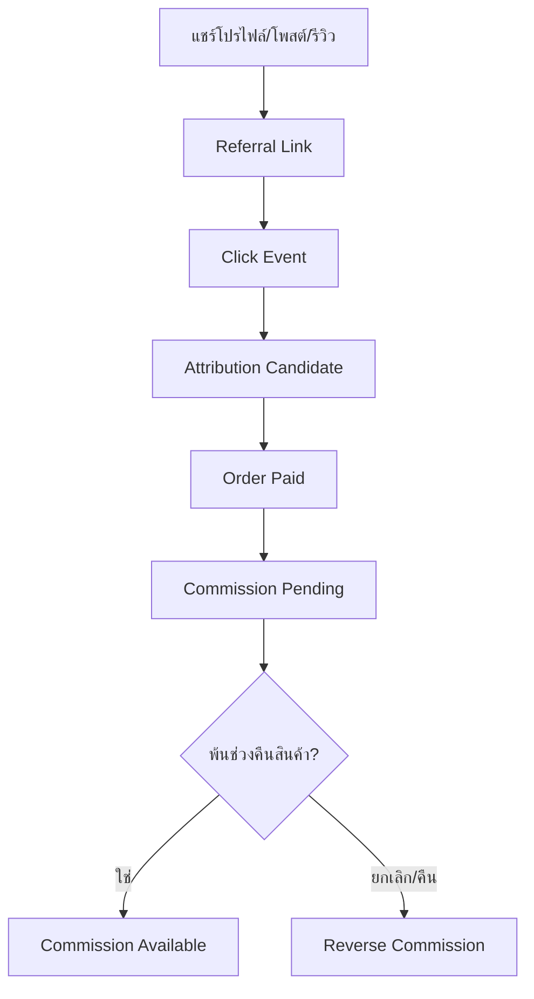

# AVENZO ONE Codex Implementation Starter Plan V7.1

> แผนแม่บทฉบับอัปเดตสำหรับพัฒนา AVENZO ONE แบบ Vertical Slice โดยใช้ V6 เป็นฐาน และเพิ่ม Customer Platform, Loyalty, Community และ Referral Commerce

**เวอร์ชัน:** 7.1

**วันที่:** 13 สิงหาคม 2026

**สถานะ:** พร้อมใช้วางสถาปัตยกรรมและแตกงานพัฒนา

**ระบบเป้าหมาย:** Web Application แบบ Multi-tenant รองรับการขยายเป็น SaaS

---

## 1. ขอบเขตของ V7

V7 รับรองข้อกำหนดทั้งหมดของ `AVENZO ONE Codex Implementation Starter Plan V6` และเพิ่มโดเมนลูกค้าโดยไม่เปลี่ยนหลักการเดิมเรื่อง Multi-tenant, Permission, RLS, Audit Log, Domain Event, Stock Movement Ledger, Order Revision, Promotion Engine และ Fulfillment Lifecycle

สิ่งที่เพิ่ม:

- `Customer 360` เป็นฐานลูกค้ากลาง แยกจากรายงานยอดขาย
- สมัครและเชื่อมบัญชีด้วย LINE, Google หรือ Facebook
- ประวัติซื้อ แต้ม ระดับสมาชิก คูปอง เครดิต และความยินยอม
- โปรไฟล์ลูกค้าแบบ Public/Private ที่ไม่เปิดเผยข้อมูลส่วนตัว
- ข่าวร้าน สินค้าใหม่ โปรโมชัน และแจ้งเตือนไลฟ์
- Inbox และการโต้ตอบระหว่างร้านกับลูกค้า
- รีวิวจากผู้ซื้อจริง โพสต์ รูป/วิดีโอ และลิงก์ซื้อสินค้า
- Referral Link และ Sales Attribution
- Commission Ledger, ระยะพักค่านายหน้า และการย้อนรายการเมื่อคืนสินค้า
- Feed ชุมชนขนาดเล็ก โดยยังไม่สร้างระบบวิดีโอหรือ Recommendation Engine แบบ TikTok

---

## 2. หลักการออกแบบที่ล็อกใน V7

### 2.1 รายงานยอดขายไม่ใช่ฐานลูกค้า

รายงานยอดขายเป็นข้อมูลธุรกรรมตามออเดอร์ ใช้ตอบคำถามว่าใครซื้ออะไร เมื่อใด ช่องทางไหน และยอดเท่าไร แต่ห้ามใช้เป็น Master Customer โดยตรง

โครงสร้างที่ถูกต้อง:

> Identity → Customer → Order → Loyalty → Content → Referral → Commission

ลูกค้าคนเดิมอาจมีชื่อ Facebook, ชื่อผู้รับ, เบอร์โทร, LINE และ Google ต่างกัน ระบบต้องรวมด้วยกฎที่ตรวจสอบได้ ไม่รวมอัตโนมัติเพียงเพราะชื่อคล้ายกัน

### 2.2 Customer ID กลาง

- ลูกค้าหนึ่งคนมี `customer_id` กลางหนึ่งรายการต่อร้าน/องค์กร
- ลูกค้าหนึ่งคนเชื่อมหลาย Identity Provider ได้
- การเชื่อมบัญชีใหม่ต้องไม่สร้างแต้ม เครดิต หรือประวัติซื้อซ้ำ
- การรวม Customer Record ต้องมี Preview, เหตุผล, ผู้อนุมัติ และ Audit Log
- การแยกบัญชีที่รวมผิดต้องย้อนกลับได้โดยไม่ทำลาย Ledger

### 2.3 ข้อมูลส่วนตัวแยกจากข้อมูลสาธารณะ

| ข้อมูลส่วนตัว | ข้อมูลสาธารณะที่ลูกค้าเลือกเปิด |
|---|---|
| เบอร์โทร อีเมล ที่อยู่ | รูปโปรไฟล์และชื่อแสดง |
| ประวัติซื้อ ยอดชำระ คืนเงิน | Bio, รีวิว และโพสต์ |
| แต้ม เครดิต คูปอง | สินค้าที่แนะนำ |
| บัญชีรับเงินและเอกสารยืนยัน | จำนวนผู้ติดตาม/กำลังติดตาม |
| Consent และประวัติการติดต่อ | ลิงก์โปรไฟล์สาธารณะ |

การเปิดโปรไฟล์เป็น Public ไม่ทำให้ข้อมูลฝั่งซ้ายเปิดเผย

### 2.4 นายหน้าชั้นเดียวก่อน

V7 ออกแบบและพัฒนาระยะแรกเป็น Single-level Referral:

> ลูกค้า A แชร์รีวิว/โพสต์ → ลูกค้า B ซื้อผ่านลิงก์ → ลูกค้า A ได้ค่านายหน้า

ระบบฐานข้อมูลเตรียมขยายหลายระดับได้ แต่ Multi-level/Downline ยังไม่เปิดใช้จนกว่าจะมีกฎธุรกิจ การบัญชี ภาษี Anti-fraud และการตรวจข้อกฎหมายที่ชัดเจน

---

## 3. Customer 360

### 3.1 Customer Profile ภายในร้าน

เจ้าหน้าที่ที่มีสิทธิ์ควรเห็น:

- Customer ID, ชื่อ และช่องทางที่เชื่อม
- Timeline การสั่งซื้อ ชำระเงิน จัดส่ง คืนสินค้า และเคสบริการ
- Lifetime Value, จำนวนออเดอร์, ซื้อครั้งล่าสุด และความถี่
- แต้ม ระดับสมาชิก คูปอง เครดิต และค่านายหน้า
- แท็ก กลุ่มลูกค้า หมายเหตุ และผู้ดูแล
- Consent รายช่องทางและหัวข้อที่ยินยอม
- รีวิว โพสต์ รายงานเนื้อหา และสถานะการ Moderation
- Referral Performance โดยไม่เปิดข้อมูลของลูกค้าปลายทางเกินจำเป็น

### 3.2 Identity Resolution

ระดับการจับคู่:

| ระดับ | ตัวอย่าง | การดำเนินการ |
|---|---|---|
| Verified | OAuth Provider ID เดียวกัน | เชื่อมอัตโนมัติได้ |
| Strong | เบอร์/อีเมลที่ยืนยันตรงกัน | เสนอให้เชื่อมและยืนยัน |
| Possible | ชื่อ/ที่อยู่คล้ายกัน | เข้าคิวตรวจ ห้ามรวมอัตโนมัติ |
| Conflict | ประวัติหรือเจ้าของบัญชีขัดกัน | ระงับการรวมและให้เจ้าหน้าที่ตรวจ |

ต้องมี `customer_merge_cases` และ `customer_merge_audits` สำหรับกรณีรวม/แยกบัญชี

### 3.3 ตารางหลัก

| ตาราง | หน้าที่ |
|---|---|
| `customers` | Customer ID กลางของร้าน |
| `customer_identities` | LINE/Google/Facebook/Auth Identity |
| `customer_private_profiles` | PII และข้อมูลติดต่อ |
| `customer_public_profiles` | ชื่อแสดง รูป Bio และ Visibility |
| `customer_addresses` | ที่อยู่พร้อมประวัติและค่า Default |
| `customer_consents` | ความยินยอมตามหัวข้อ ช่องทาง และเวลา |
| `customer_tags` | Tag/Segment สำหรับ CRM |
| `customer_notes` | หมายเหตุภายในและสิทธิ์การเข้าถึง |
| `customer_merge_cases` | คิวตรวจบัญชีที่อาจเป็นคนเดียวกัน |
| `customer_merge_audits` | ประวัติรวมและแยก Customer |

---

## 4. Authentication และ Account Linking

### 4.1 ช่องทางสมัคร

- LINE Login
- Google Sign-In
- Facebook Login

ลูกค้าต้องใช้ขั้นต่ำหนึ่งช่องทาง และเพิ่มช่องทางอื่นภายหลังได้ การตั้งรหัสผ่านไม่จำเป็นในรุ่นแรกหากใช้ OAuth ทั้งหมด

### 4.2 กฎความปลอดภัย

- ตรวจ Provider Token ฝั่ง Server
- ใช้ Provider Subject ID เป็นกุญแจหลัก ไม่ใช้ชื่อแสดง
- Account Linking ต้องยืนยันกับ Identity เดิมและ Identity ใหม่
- เปลี่ยนอีเมล/เบอร์ต้อง Re-verify
- Login, Link, Unlink และ Merge ต้องมี Security Audit
- ห้าม Unlink วิธีเข้าสู่ระบบสุดท้ายก่อนเพิ่มวิธีใหม่
- Session และ OAuth Redirect ต้องแยก Environment

### 4.3 การผูกออเดอร์เก่า

เมื่อสมัครสมาชิก ระบบเสนอออเดอร์เดิมที่น่าจะเป็นของลูกค้า แต่ต้องยืนยันด้วยข้อมูลที่ควบคุมได้ เช่น OTP เบอร์โทรหรือข้อมูลอ้างอิงออเดอร์ ห้ามให้ผู้ใช้ Claim ประวัติจากชื่อผู้รับเพียงอย่างเดียว

---

## 5. Customer Portal รุ่นแรก

### 5.1 หน้า Home

- สถานะออเดอร์ล่าสุด
- แต้ม ระดับสมาชิก คูปอง และเครดิต
- โปรโมชันที่มีสิทธิ์ใช้
- สินค้าใหม่และสินค้าแนะนำจากร้าน
- สถานะไลฟ์และกำหนดการไลฟ์ถัดไป
- Notification/Inbox ล่าสุด

### 5.2 หน้า Purchase History

- รายการซื้อและรายละเอียดราคา/ส่วนลด
- สถานะชำระเงิน แพ็ก ส่ง และเลขพัสดุ
- ดาวน์โหลดเอกสารที่ได้รับอนุญาต
- เปิด After-sales Case
- ปุ่มรีวิวเฉพาะสินค้าที่ผ่านเงื่อนไข

### 5.3 หน้า Loyalty & Wallet

- แต้มคงเหลือ แต้มรอรับ และแต้มใกล้หมดอายุ
- ประวัติได้/ใช้/คืน/หมดอายุแบบ Ledger
- ระดับสมาชิกและเงื่อนไขรักษาระดับ
- คูปองที่ใช้ได้/ใช้แล้ว/หมดอายุ
- Customer Credit แยกจาก Commission Balance

### 5.4 หน้า Public Profile

- รูป ชื่อแสดง Bio และลิงก์โปรไฟล์
- รีวิว/โพสต์ที่เปิด Public
- สินค้าที่แนะนำ
- สถิติ Public ขั้นต่ำ เช่น จำนวนโพสต์และผู้ติดตาม
- ปุ่ม Follow, Share และ Report

ไม่แสดงยอดซื้อ แต้ม เครดิต ที่อยู่ เบอร์โทร รายได้ค่านายหน้า หรือ Order ID

---

## 6. Loyalty และ Customer Credit

### 6.1 Loyalty Ledger

แต้มต้องเป็น Ledger ห้ามแก้ยอดคงเหลือตรง ๆ

สถานะรายการแต้ม:

`pending → available → redeemed / expired / reversed`

กฎเบื้องต้น:

- แต้มจากการซื้อเข้า `pending` จนพ้นเงื่อนไขยกเลิก/คืน
- ยกเลิกหรือคืนสินค้าต้องย้อนแต้มตามสัดส่วนที่อนุมัติ
- คืนส่วนลด/คูปองต้องใช้ Rule ที่ระบุ ไม่คำนวณตามความจำ
- การปรับแต้มด้วยมือต้องมีเหตุผลและสิทธิ์อนุมัติ
- `Customer Credit`, `Loyalty Point` และ `Commission` เป็นคนละ Ledger ห้ามรวมยอด

### 6.2 ตารางหลัก

- `loyalty_programs`
- `loyalty_tiers`
- `loyalty_rules`
- `loyalty_accounts`
- `loyalty_ledger_entries`
- `customer_credit_accounts` และ `customer_credit_ledger_entries` จาก V6
- `coupons`, `coupon_issuances`, `coupon_redemptions`

กฎอัตราแต้ม วันหมดอายุ การเลื่อนระดับ และการใช้ร่วมกับโปรโมชันยังเป็น Decision Gate ก่อน Implement

---

## 7. Content, Review และ Community

### 7.1 Verified Purchase Review

รีวิวเชื่อมกับ `order_item_id` เพื่อแสดงป้ายซื้อจริง โดยหนึ่งรายการสินค้าต้องรีวิวได้ตาม Policy ของร้านและไม่สร้างรีวิวซ้ำจากการแก้ข้อความ

เนื้อหาที่รองรับ:

- คะแนนและข้อความ
- รูปภาพ
- วิดีโอสั้นในระยะถัดไป
- Product/SKU ที่เกี่ยวข้อง
- Visibility: `public`, `followers`, `private`
- ปุ่มซื้อสินค้าตามรีวิว
- ลิงก์แชร์ภายนอกพร้อม Referral Code

### 7.2 Feed ขนาดเล็ก

รุ่นแรกเป็น Feed ตามเวลาและสิทธิ์การมองเห็น ประกอบด้วย:

- ประกาศและโพสต์จากร้าน
- โปรโมชันและสินค้าใหม่
- รีวิว/โพสต์จากลูกค้าที่ติดตามหรือเป็น Public
- แจ้งสถานะ Live

ไม่รวมในรุ่นแรก:

- Algorithmic Recommendation ซับซ้อน
- Infinite short-video experience
- Live streaming ที่ Host ภายใน AVENZO
- Direct message ระหว่างลูกค้ากับลูกค้า

### 7.3 Moderation

- ลูกค้าแก้/ลบโพสต์ของตนได้ตาม Policy พร้อมประวัติที่จำเป็น
- ร้านซ่อนหรือจำกัดการมองเห็นได้ แต่ต้องมีเหตุผลและ Audit
- ผู้ใช้ Report เนื้อหา/บัญชีได้
- มีคิวตรวจ `pending`, `approved`, `hidden`, `rejected`, `appealed`
- Media Upload ต้องจำกัดชนิด ขนาด และตรวจเนื้อหาที่ไม่เหมาะสม
- เก็บ Policy Version ที่ผู้โพสต์ยอมรับ

### 7.4 ตารางหลัก

- `content_posts`
- `product_reviews`
- `content_media`
- `content_product_links`
- `content_reactions`
- `customer_follows`
- `content_reports`
- `moderation_actions`
- `store_announcements`

---

## 8. Referral Attribution

### 8.1 Tracking Flow



### 8.2 ข้อมูลที่ต้องติดตาม

- Referrer Customer
- Link/Referral Code
- Source Object: profile, post, review หรือ campaign
- Product/SKU ที่เชื่อม
- Click Time, Channel และ Campaign Parameters
- Session/Attribution Window
- Order และ Order Item ที่เกิด Conversion
- Revenue Base, Commission Rule และ Calculation Snapshot
- สถานะยกเลิก คืนสินค้า ปลดล็อก และจ่ายเงิน

### 8.3 Attribution Policy ที่ต้องล็อกก่อน Implement

- First-click หรือ Last-click
- ระยะเวลา Attribution เช่น 7/14/30 วัน
- กรณีกดหลายลิงก์จากหลายคน
- กรณีใช้ Referral ร่วมกับ Paid Ads/Coupon
- Commission คิดจากยอดก่อนหรือหลังส่วนลด ค่าส่ง ภาษี และคืนสินค้า
- สินค้า/หมวดใดไม่มีค่านายหน้า
- ขีดจำกัดต่อออเดอร์/เดือน

ค่าเริ่มต้นที่แนะนำสำหรับ Prototype คือ Last eligible click ภายใน 7 วัน และบันทึก Snapshot ของกฎที่ใช้กับออเดอร์

### 8.4 Anti-fraud

- ห้าม Self-referral
- ตรวจบัญชีซ้ำ Device/Payment/Address ตามระดับความเสี่ยงและกฎหมาย
- ไม่ให้ค่านายหน้ากับออเดอร์ทดสอบ ยกเลิก หรือคืนเต็มจำนวน
- ระงับรายการผิดปกติไว้ตรวจแทนการลบทิ้ง
- มี Velocity Limit และ Risk Flag
- การ Override ต้องมีผู้อนุมัติ เหตุผล และ Audit

---

## 9. Commission Ledger และ Payout

### 9.1 Lifecycle

`estimated → pending → available → payout_requested → paid`

เส้นทางข้อยกเว้น:

`pending/available → held → released`  
`pending/available → reversed`

กฎสำคัญ:

- ห้ามเพิ่มยอดค่านายหน้าใน Customer Credit โดยตรง
- ทุก Commission อ้างอิง Order Item, Attribution และ Rule Snapshot
- คืนบางรายการต้อง Reverse ตามส่วนที่คืน
- ถ้าจ่ายแล้วจึงเกิดคืนสินค้า ให้สร้างยอดติดลบ/หักรอบถัดไปตาม Policy ห้ามแก้ Ledger เดิม
- การถอนต้องผ่านเกณฑ์ขั้นต่ำ การตรวจตัวตน และข้อมูลรับเงิน
- การจ่ายเงินจริงต้องมี Payout Batch, Payment Reference และ Reconciliation

### 9.2 ตารางหลัก

- `referral_links`
- `referral_clicks`
- `attribution_records`
- `commission_programs`
- `commission_rules`
- `commission_ledger_entries`
- `commission_holds`
- `payout_accounts`
- `payout_requests`
- `payout_batches`
- `payout_items`

---

## 10. Notification และการสื่อสาร

### 10.1 ประเภทการแจ้งเตือนลูกค้า

- ออเดอร์ การชำระ แพ็ก จัดส่ง และคืนสินค้า
- ร้านเริ่มไลฟ์หรือใกล้ถึงเวลาไลฟ์
- โปรโมชั่นและสินค้าใหม่
- แต้ม/คูปองใกล้หมดอายุ
- มีคนตอบ กดถูกใจ หรือติดตาม
- มี Conversion จาก Referral
- Commission พร้อมถอนหรือจ่ายแล้ว

### 10.2 Consent และ Preference

- แยก Transactional กับ Marketing Notification
- ลูกค้าเลือกหัวข้อ ช่องทาง ความถี่ และ Quiet Hours ได้
- ช่องทางภายนอกใช้เมื่อมี Consent และ Connection ที่ยังใช้ได้
- Unsubscribe การตลาดต้องไม่ปิดข้อความธุรกรรมที่จำเป็น
- ทุกการส่งมี Delivery Log, Provider Response และ Retry Policy
- Broadcast ต้องมี Audience Preview, จำนวนผู้รับ, Approval และ Rate Limit

Inbox รุ่นแรกให้ร้านส่งประกาศหรือดู Thread ร้าน–ลูกค้าได้ ส่วนลูกค้า–ลูกค้ายังไม่รวม

---

## 11. Domain Events เพิ่มเติม

- `customer.registered`
- `customer.identity_linked`
- `customer.merge_requested`
- `customer.merged`
- `customer.consent_changed`
- `loyalty.points_pending`
- `loyalty.points_available`
- `loyalty.points_reversed`
- `review.created`
- `content.reported`
- `content.moderated`
- `store.live_started`
- `referral.link_opened`
- `referral.attributed`
- `commission.estimated`
- `commission.available`
- `commission.held`
- `commission.reversed`
- `payout.requested`
- `payout.paid`

Event ต้องมี `organization_id`, Actor, Customer, Source Entity, Correlation ID, Occurred At และ Idempotency Key ตามความเหมาะสม

---

## 12. Permission, Privacy และ Tenant Isolation

### 12.1 บทบาทเพิ่มเติม

| Role | ขอบเขต |
|---|---|
| CRM Manager | Customer 360, Segment และ Campaign |
| Community Moderator | Review, Post, Report และ Moderation |
| Loyalty Manager | Rule แต้ม Tier และ Coupon |
| Affiliate Manager | Referral, Commission, Hold และ Payout |
| Support Agent | Order/Customer Timeline ตามข้อมูลที่จำเป็น |

### 12.2 กฎบังคับ

- ทุก Customer/Content/Referral/Commission Record ต้องผูก `organization_id`
- RLS ป้องกันข้อมูลข้ามร้านและแยก Staff View กับ Customer View
- Customer อ่านข้อมูลส่วนตัวของตนเองเท่านั้น
- Public Query ใช้ View/DTO ที่ Allowlist Field ห้ามเปิดตาราง PII โดยตรง
- จำกัดการค้นหารายชื่อลูกค้าเพื่อป้องกัน Enumeration
- Media ใช้ Signed/Controlled Access ตาม Visibility
- Export/Delete Request ต้องรองรับข้อกำหนดด้านข้อมูลส่วนบุคคลและ Retention Policy
- Log ห้ามเก็บ Token, PII เต็ม หรือข้อมูลบัญชีรับเงินเกินจำเป็น

ก่อน Production ต้องให้ผู้เชี่ยวชาญตรวจ PDPA, เงื่อนไขการตลาด, ภาษี/เอกสารค่านายหน้า และข้อกำหนดของ OAuth/Messaging Provider

### 12.3 Platform Foundation Roadmap Status

อัปเดตล่าสุด: 13 สิงหาคม 2026

| ระยะ | สถานะ | หมายเหตุ |
|---|---|---|
| Phase 0.1–0.8 Multi-tenant, Role, Auth, Invitation และ Member Management | เสร็จแล้ว | ผ่านการทดสอบการใช้งานหลักและสิทธิ์สมาชิก |
| Phase 0.9 Security Hardening และ Audit Log | เสร็จสำหรับ Development | Password ขั้นต่ำ 8 ตัวอักษร, Strong Character Requirements, Secure Password Change และ Current Password Verification เปิดแล้ว |
| Phase 0.9 Production Security Gate | รอก่อน Production | ต้องอัปเกรด Supabase เป็น Pro เปิด Leaked Password Protection และตรวจ Security Advisor ให้ไม่มี WARN |
| Phase 0.10.1 Platform Admin TOTP Enrollment | เสร็จและทดสอบผ่าน | มีหน้า QR/Secret, ยืนยันรหัส 6 หลัก, ตรวจ Platform Admin ซ้ำ และ Audit โดยไม่เก็บ TOTP Secret หรือ OTP |
| Phase 0.10.2 Platform Admin MFA Challenge | เสร็จและทดสอบผ่าน | Login นำทางอัตโนมัติ, หน้า Challenge รหัส 6 หลัก, Server ตรวจ AAL ซ้ำ และมีปุ่มลัด Platform Admin |
| Phase 0.10.3 Platform Admin MFA RLS Enforcement | Implemented / รอทดสอบครบเส้นทาง | บังคับ `aal2` ที่ Database/RLS สำหรับสิทธิ์ Control Plane โดยไม่กระทบ Tenant RBAC |
| Phase 0.10.4 Platform Admin MFA Recovery | Implemented / รอทดสอบการใช้งานจริง | รองรับ Authenticator หลักและสำรอง, เลือก Factor ตอน Challenge, ถอดอุปกรณ์แบบคง Factor สุดท้าย, Session Revocation และ Audit Log |
| Phase 0.10.4.1 Preferred Authenticator & MFA Layout | เสร็จและทดสอบ Local ผ่าน | การ์ด MFA เต็มความกว้าง, แสดงเครื่องหลัก/สำรอง, เปลี่ยนเครื่องหลักได้โดยไม่ถอดอุปกรณ์, หน้า Challenge เลือกเครื่องหลักเป็นค่าเริ่มต้น พร้อม AAL2, RLS และ Audit Log |
| Phase 1.0.1 Feature Catalog | Implemented / รอทดสอบการใช้งานจริง | ทะเบียน Feature แบบเปิด/ปิดหรือ Limit พร้อม Combo Box ภาษาคนและโหมดกำหนดเอง, Lifecycle, AAL2 RLS และ Audit Log โดยยังไม่กระทบ Entitlement ปัจจุบัน |
| Phase 1.0.2 Plans และ Prices | Implemented / รอทดสอบการใช้งานจริง | สร้าง Plan, Plan Version, ราคา, Trial และค่า Feature โดยยังไม่กระทบ Subscription เดิม |
| Phase 1.0.2.1 Plan Lifecycle Management | Implemented / รอทดสอบการใช้งานจริง | เก็บ Draft, ปิดใช้งาน Plan และ Retired แบบไม่ลบข้อมูล พร้อม Audit Log |
| Phase 1.0.3 Entitlement Enforcement | เสร็จและทดสอบผ่าน | ผูก Organization Subscription กับ Active Plan Version, บังคับสิทธิ์และจำนวนสาขาที่ Database/UI, รองรับ Legacy Subscription และผ่านการ Provision จริงกับ AVENZO THAILAND |
| Phase 1.0.3.1 Draft Version Editing | Implemented / รอทดสอบ UI โดยผู้ใช้ | แก้ Draft Version, อายุ, Grace, ราคาและ Feature เดิมได้; เก็บ Draft แบบ Retired และล็อก Active Version เป็น Snapshot |
| Phase 1.0.4.1 Subscription Preview & Automatic Dates | เสร็จและทดสอบผ่าน | เลือกราคา Active, คำนวณ Expiry/Grace/Trial อัตโนมัติ, ตรวจสอบข้อมูลก่อนยืนยัน และบันทึก Price Snapshot ใน Subscription Event สำเร็จ โดยยังไม่เรียกเก็บเงินจริง |
| Phase 1.0.4.2 Subscription Lifecycle & History | Implemented / รอทดสอบ UI โดยผู้ใช้ | สถานะภาษาไทย Trial/Active/Grace/Suspended/Expired/Canceled, Action ต่ออายุ/ปรับ/พัก/เปิดต่อ/ยกเลิก, Preview, Event History 10 รายการต่อหน้า และ Command ID ป้องกันคำสั่งซ้ำ |
| Phase 1.0.4.2.1 Form Typography & Inline Validation | Implemented / รอทดสอบ UI โดยผู้ใช้ | ฟอนต์ช่องกรอกเป็นมาตรฐานเดียวกัน, ปิด Browser Popup, แจ้งเตือนด้วยไอคอน i, รองรับ aria และตรวจเหตุผลอย่างน้อย 3 ตัวอักษร |
| Phase 1.0.5.1 Notification Rules & Queue | เสร็จและทดสอบผ่าน | กฎแจ้งเตือน 7 ช่วงเวลา, Queue Preview, ป้องกันรายการซ้ำ, Owner Recipient, AAL2 RLS, Audit Log และ UI 10 รายการต่อหน้า โดยยังไม่ส่งอีเมลจริง |
| Phase 1.0.5.2 Scheduler & Delivery Worker | Production Live Delivery พร้อมใช้งาน | Atomic Claim, Resend Idempotency, Retry Backoff สูงสุด 5 ครั้ง, Delivery Log, Manual Run และ Supabase Cron รายชั่วโมง; Endpoint Production และ Resend delivery ทำงานแล้ว |
| Phase 1.0.5.3 Resend Webhook & Suppression | เสร็จและเชื่อม Production แล้ว | ตรวจลายเซ็น Svix จาก Raw Body, กัน Event ซ้ำและ Event มาไม่เรียงลำดับ, แสดงสถานะส่งจริงภาษาไทย และหยุดส่งอัตโนมัติเมื่อ Bounce/Complaint/Suppression |
| Phase 1.0.5.4 Production Deployment & Supabase Cron | เสร็จและทดสอบผ่าน | Deploy บน Vercel Hobby ที่ `app.avenzoone.com`, ใช้ Supabase Cron รายชั่วโมง, เก็บ Secret ใน Vault, ตั้ง Supabase Auth Redirect และเชื่อม Resend Webhook; ทดสอบ Browser/API/Cron ได้ HTTP 200 |
| Phase 1.0.6 Production Monitoring & Alerts | เสร็จและทดสอบ Production ผ่าน | บันทึก Worker Run, ตรวจ Cron/Queue/Resend/Webhook, แสดง Alert ภาษาไทยสำหรับ Platform Admin AAL2, เพิ่ม Structured Runtime Log, จำกัด Vercel Environment Variables ให้เฉพาะ Production และทดสอบ Worker โหมด Live ได้ HTTP 200 โดยไม่มี Error |
| Phase 1.1.0 Billing Foundation | Implemented และทดสอบ Database/Build ผ่าน | เชื่อม Organization, Subscription, Plan Version และราคาเป็น Invoice Snapshot; รองรับส่วนลด ภาษี สถานะภาษาไทย Payment History แบบ Provider-neutral, Preview, Pagination, Command ID, AAL2 RLS และ Audit Log โดยยังไม่มีการตัดเงินจริง |
| Phase 1.1.1 Invoice Documents & Correction Policy | เสร็จและทดสอบผ่าน | เพิ่มข้อมูลผู้ออก/ผู้รับเอกสาร, Invoice Document Snapshot, หน้าพิมพ์, การล็อกยอดหลังออกเอกสาร, ยกเลิกเอกสาร และ Credit Note โดยยังไม่เป็นเอกสารภาษีตามกฎหมายและยังไม่มี Refund/Payment Gateway |
| Phase 1.1.2 Payment Gateway Sandbox & Reconciliation Foundation | Implemented / รอทดสอบ Local | เพิ่ม Payment Attempt, Event Ledger, Idempotency, Audit และ Sandbox จำลองผลสำเร็จ/ไม่สำเร็จโดยไม่ตัดเงินจริง พร้อมแยก Payment Manual ออกจาก Gateway |
| Phase 1.1.2.1 Automatic Tax Calculation | เสร็จและทดสอบ Local ผ่าน | เลือกไม่มีภาษี/เปอร์เซ็นต์/จำนวนเงิน คำนวณจากฐานหลังหักส่วนลด ปัดสองตำแหน่ง และแสดงสูตรพร้อมยอดจริงก่อนสร้าง Invoice |
| Phase 1.1.3.1 Payment Requirements | เสร็จแล้ว | กำหนดตลาดไทย/THB, PromptPay QR, บัตรและโอนธนาคารสำรอง, Manual Renewal รุ่นแรก, Refund/Reconciliation/Security และเกณฑ์ให้คะแนน Provider โดยยังไม่สมัครบริการหรือมีค่าใช้จ่าย |
| Phase 1.1.3.2 Payment Provider Comparison | เสร็จแล้ว | เปรียบเทียบ Stripe, Omise, 2C2P และ GB Prime Pay จากข้อมูลทางการ; เลือก Stripe เป็น Sandbox Provider หลักและ Omise เป็นสำรองแบบ provisional โดยยังไม่สมัคร ไม่สร้าง Secret และไม่เสียค่าใช้จ่าย |
| Phase 1.1.3.3 Stripe Test Checkout & Fee Snapshot | เสร็จและทดสอบ Local E2E ผ่าน | เพิ่ม Hosted Checkout สำหรับ PromptPay/บัตร, Webhook ตรวจลายเซ็นและ Idempotency, Success/Cancel Page และ UI แสดงค่าธรรมเนียมประมาณการ/ผู้รับภาระ/ยอดลูกค้าชำระ พร้อมเก็บ Fee Snapshot โดยใช้ Test Mode เท่านั้น |
| Phase 1.1.3.4 Stripe Sandbox Acceptance & Reconciliation | เสร็จและ Deploy Production ผ่าน | Card Success, PromptPay QR/Expired, Duplicate Webhook และ Invoice State Guard ผ่าน; เพิ่มปุ่มตรวจค่าธรรมเนียมจริง ยอดสุทธิและส่วนต่างจากประมาณการ โดยจำกัดสิทธิ์ Platform Admin + AAL2; Deploy เฉพาะ `adora3/avenzo-one` |
| Phase 1.1.3.5.1 Payment Exception Queue | เสร็จและ Deploy Production ผ่าน | เพิ่มคิว Read-only สำหรับ Webhook ล้มเหลว, Invoice ไม่ตรงกับ Payment, รอกระทบยอด, ชำระล้มเหลว/หมดเวลา/ยกเลิก และ Pending เกิน 30 นาที; ตรวจ 100 Attempt ล่าสุด แสดง 10 รายการ และซ่อน Attempt เก่าที่ Invoice ชำระสำเร็จแล้ว |
| Phase 1.1.3.5.2 Retry & Reconciliation Actions | เสร็จและ Deploy Production ผ่าน | เพิ่มคำสั่งตรวจค่าธรรมเนียม, ตรวจ/ซ่อมสถานะ Provider และสร้าง Checkout ใหม่ พร้อม Preview, เหตุผล, AAL2, Command Idempotency, Server-only Stripe Test Mode และ Audit Trail |
| Phase 1.1.3.5.3 Exception Operations Hardening | เสร็จและ Deploy Production ผ่าน | เพิ่มกำหนดเวลาตรวจสอบตามชนิดปัญหา, การเตือนรายการเกินกำหนด, ตัวกรองคิว, ค้นหา/กรอง/แบ่งหน้าประวัติคำสั่ง และ Production Runbook โดยยังคง Stripe Test Mode เท่านั้น; Deploy เฉพาะ `adora3/avenzo-one` |
| Phase 1.1.3.6 Billing Production Readiness Gate | เสร็จและทดสอบ Local ผ่าน | เพิ่มหน้าตรวจความพร้อมอัตโนมัติและ Checklist 9 ข้อพร้อมหลักฐาน, บันทึกผลแบบ Immutable Audit ด้วย Platform Admin + AAL2 และแสดง Go/No-Go โดยยังล็อก Stripe Test Mode และไม่เปิดรับเงินจริง |
| Phase 1.1.3.7.1 ศูนย์ควบคุมการรับเงินจริง / Live Safety Architecture & Kill Switch | Local test passed / ผ่านการทดสอบ | เพิ่ม Environment Lock, Database Emergency Stop, สถานะ locked/review_ready, AAL2 Command Preview และ Immutable Audit โดยฐานข้อมูลบังคับ Emergency Stop และยังไม่มีทางเปิดรับเงินจริง |
| Phase 1.1.3.7.2 Test/Live Credentials & Live Webhook Isolation | Implemented / รอทดสอบ Local | แยก Test/Live Secret และ Webhook Signing Secret เป็น Server-only คนละชุด เพิ่ม Live Webhook ที่ตรวจลายเซ็นและกักเฉพาะ Metadata/Hash โดย Emergency Stop ปิดการประมวลผลและยังไม่มี Live Checkout |
| Phase 1.1.3.7.3 Limited Live Pilot Guardrails | Local test passed / ทดสอบผ่าน | เพิ่ม Tester Allowlist, วงเงินสูงสุดต่อครั้ง, ยอดสะสม, จำนวนครั้ง, Dry Run และ Emergency Rollback ที่บังคับฝั่งฐานข้อมูลพร้อม Immutable Audit โดย Phase นี้ยังล็อก Pilot และยังไม่รับเงินจริง |
| Phase 1.1.3.7.4 Two-person Approval | Implemented / รอทดสอบ Local | เพิ่มคำขออนุมัติอายุ 24 ชั่วโมง ผู้ขอและผู้อนุมัติต้องเป็น Platform Admin คนละบัญชีพร้อม AAL2, ล็อก Snapshot กติกา และบันทึก Immutable Audit โดยยังคง Pilot ปิดและ Emergency Stop เปิด |
| Phase 1.1.3.7.4.1 Platform Admin Access Management | Local test passed / ทดสอบผ่าน | เพิ่มหน้า Super Admin สำหรับมอบสิทธิ์ เปลี่ยนระดับ พักชั่วคราว และเปิดสิทธิ์ Platform Admin กลับ โดยบังคับ AAL2, ยืนยันก่อนบันทึก, ป้องกันการแก้สิทธิ์ตัวเองและ Super Admin คนสุดท้าย พร้อม Immutable Audit Log |
| Phase 1.1.3.7.4.2 Approval Prerequisite Guard | Local test passed / ทดสอบผ่าน | แสดงเงื่อนไข Production Readiness, review_ready, ผู้ทดสอบ และ Platform Admin ล่วงหน้า ปิดปุ่มส่งคำขอจนกว่าจะครบ พร้อมลิงก์ไปแก้แต่ละข้อ และอ่านข้อความผิดพลาดจาก Supabase เป็นภาษาไทยโดยยังไม่เปลี่ยน Safety State หรือเปิดรับเงินจริง |
| Phase 1.1.3.7.4.3 End-to-end Two-person Verification | Local test passed / ทดสอบผ่าน | แสดงบทบาทผู้ขอและผู้พิจารณา พร้อมตรวจหลักฐานจริง 4 ข้อจาก Request, Audit Event และ Safety Lock โดยผู้ขอไม่เห็นปุ่มอนุมัติคำขอตนเองและยังไม่เปิดรับเงินจริง |
| Phase 1.1.3.7.5.1 Controlled Live Checkout UI | Production test passed / ทดสอบ Production ผ่าน | เพิ่ม UI จำลองสำหรับเลือกผู้ทดสอบ กรอกยอดและรหัสอ้างอิง ตรวจ Production Readiness, Two-person Approval, Policy, Credentials และ Safety Lock พร้อมหน้าสรุป โดยไม่สร้าง Checkout Session, Payment Intent หรือรับเงินจริง |
| Phase 1.1.3.7.5.2 Server Eligibility & Dry-run Audit | Local test passed / ทดสอบผ่าน | เพิ่ม API ตรวจ Eligibility ฝั่ง Server สำหรับ Platform Admin + AAL2 ตรวจ Approval Snapshot, Tester, วงเงิน, Credentials และ Safety Lock พร้อม Immutable Dry-run Audit โดยบังคับ real_charge=false และไม่เรียก Stripe Live API |
| Phase 1.1.3.7.5.3 Contract & Abuse-case Tests | Local test passed / ผู้ใช้ทดสอบผ่าน | เพิ่ม Contract กลางและปุ่มทดสอบ Server 4 กรณี: ไม่มี AAL2, Tester นอก Allowlist, ยอดเกินวงเงิน และ Command ซ้ำ พร้อมตรวจ HTTP 401 และยืนยัน Idempotency เหลือเพียง 1 Audit โดยทุกกรณี real_charge=false และไม่เรียก Stripe Live API |
| Phase 1.1.3.7.5.4 Release Gate & Evidence Pack | Production deployed / เผยแพร่แล้ว | เพิ่ม Server Release Gate 10 ข้อและ Evidence Pack แบบดาวน์โหลด JSON จาก Readiness, Safety Lock, Two-person Approval, Contract Audit และ Dry-run โดยผลผ่านยังคง realMoneyAllowed=false |
| Phase 1.1.3.7.5.5 Executor Design & Feature Flag | Local ผ่าน | กำหนด Feature Flag ฝั่ง Serverให้รับเฉพาะ disabled/shadow, เพิ่ม Server Design Review และลำดับ Executor 6 ขั้น โดยบังคับ realMoneyAllowed=false, ไม่มี Checkout Endpoint จริง และไม่เรียก Stripe Live API |
| Phase 1.1.3.7.5.6 Shadow Executor Command Audit | Local test passed / ผู้ใช้ทดสอบผ่าน | จอง Command ID และ Idempotency Key จาก Dry-run ที่ผ่าน ตรวจ Safety Gate ซ้ำฝั่ง Server และบันทึก Audit แบบแก้ไขย้อนหลังไม่ได้ โดยไม่เรียก Stripe Live API และไม่มีเงินจริงเคลื่อนย้าย |
| Phase 1.1.3.7.5.7 Live Webhook Connectivity Evidence | Completed / Production 6/6 ผ่านและปิด Phase | ยืนยัน URL สาธารณะ, Secret ฝั่ง Server, Emergency Stop และ Stripe Live Event ที่ผ่านลายเซ็นและถูกกักไว้ครบ 6/6 โดยไม่สร้าง Checkout ไม่เปลี่ยน Invoice/Subscription และไม่รับเงินจริง; นำ `customer.created` ออกจาก Live Event destination หลังจบการทดสอบแล้ว |
| Phase 1.1.3.8 Bank Transfer & Slip Verification | In progress | รองรับ QR ธนาคารหรือบัญชีรับโอนของ AVENZO ONE, หน้าลูกค้าแนบสลิป, คิวตรวจหลักฐาน, ป้องกันสลิปซ้ำ, อนุมัติ/ปฏิเสธพร้อมเหตุผล, Audit และกระทบยอด โดยยังไม่ถือว่าโอนสำเร็จจนผู้มีสิทธิ์ยืนยัน |
| Phase 1.1.3.8.1 Bank Transfer Channel Setup | Local ผ่าน | Platform Admin ตั้งค่าบัญชีธนาคารหรือพร้อมเพย์ผ่าน UI, มี AAL2 + RLS + RPC + Audit + ตรวจสอบก่อนบันทึก และไม่เปลี่ยน Invoice/Payment/Subscription |
| Phase 1.1.3.8.2 Private Slip Upload | Local ผ่าน | ลูกค้าเลือก Invoice และช่องทางรับโอน ตรวจสอบข้อมูลก่อนส่ง แล้วแนบ JPG/PNG/WebP/PDF ไม่เกิน 5 MB ลง Private Storage; path ผูก Organization/Invoice/User, มี RLS + Audit และยังคง Invoice เป็นรอชำระจนเจ้าหน้าที่ตรวจ |
| Phase 1.1.3.8.3 Transfer Proof Review | Local ผ่าน | Platform Admin ที่ผ่าน MFA เปิดไฟล์ด้วย Signed URL อายุ 2 นาที ตรวจยอด/เวลา/บัญชี และรับรองหรือปฏิเสธพร้อมเหตุผล; ล็อกการอนุมัติซ้ำและยังไม่สร้าง Payment หรือเปลี่ยน Invoice/Subscription |
| Phase 1.1.3.8.4 Transfer Fulfillment | Implemented / รอผู้ใช้ทดสอบ Local | Platform Admin คนที่ 2 ซึ่งผ่าน MFA ยืนยันรับชำระจากหลักฐานที่รับรองแล้ว; ตรวจยอดตรง Invoice, ป้องกันคำสั่งซ้ำ และสร้าง Payment + เปลี่ยน Invoice เป็นชำระแล้ว + ต่ออายุ Subscription + บันทึก Event ภายใน Transaction เดียว |
| Phase 1.1.3.8.5.1 Transfer Approval Policy | Local ผ่าน | Super Admin กำหนดวงเงินอนุมัติคนเดียว (ค่าเริ่มต้น 5,000 บาท) และกฎรายการเสี่ยงผ่าน UI; มี AAL2, Version conflict protection, Idempotency, RLS/RPC และ Immutable Audit โดยยังไม่เปลี่ยนกฎรับชำระจริงจนถึง Phase 1.1.3.8.5.2 |
| Phase 1.1.3.8.5.2 Approval Policy Enforcement | Local ผ่าน | บังคับใช้นโยบายฝั่ง Server จริง: รายการปกติยอดไม่เกินวงเงินใช้ผู้ดูแล 1 คน; รายการเกินวงเงินหรือถูกระบุว่ามีความเสี่ยงใช้ Platform Admin ต่างบัญชี 2 คน พร้อม Snapshot Version/จำนวนผู้อนุมัติใน Proof, Payment และ Subscription Event |
| Phase 1.1.3.8.5.3.1 Approval Workflow Status UI | Local ผ่าน | แสดงสถานะงานและเหตุผลเป็นภาษาไทย: พร้อมยืนยันรับชำระ, รอผู้อนุมัติคนที่ 2 หรือพร้อมให้คุณอนุมัติคนที่ 2 พร้อมยอดเทียบวงเงิน สัญญาณเสี่ยง Policy Version และผู้ตรวจหลักฐานคนแรก โดยไม่เปลี่ยนกติกาฝั่ง Server |
| Phase 1.1.3.8.5.3.2 Approval Workflow Actions UI | Local ผ่าน | แสดงปุ่มและคำอธิบายสิทธิ์ตามบัญชีและสถานะจริง: ปิดปุ่มเมื่อยอดไม่ตรงหรือรอผู้อนุมัติคนที่ 2 และเปิดปุ่มสำหรับผู้มีสิทธิ์ยืนยันแบบผู้ดูแล 1 คนหรือผู้อนุมัติคนที่ 2 โดย Server ยังคงเป็นผู้บังคับใช้นโยบายสุดท้าย |
| Phase 1.1.3.8.5.3.3 Approval Timeline | Local ผ่าน | แสดงลำดับส่งหลักฐาน ตรวจผ่าน ขั้นอนุมัติปัจจุบัน และผล Payment/Invoice/Subscription ที่จะเกิดขึ้น พร้อมชื่อผู้ดำเนินการ เวลา เหตุผล และ Policy Version โดยใช้ข้อมูลเดิมและไม่เพิ่มตารางใหม่ |
| Phase 1.2.1 Session Policy Foundation | Migration ใช้กับ Supabase Production แล้ว / Contract Test + TypeScript + Production Build ผ่าน / รอทดสอบบัญชีจริง | เพิ่มนโยบาย Session ฝั่ง Server สำหรับบัญชีสิทธิ์สูง 30 นาที/8 ชั่วโมง และบัญชีองค์กร 8 ชั่วโมง/7 วัน พร้อมเตือนล่วงหน้า 5 นาที; บันทึก Session ID, Activity, Policy Snapshot และ Audit ใน private schema ผ่าน RPC ที่ผูกผู้ใช้ปัจจุบัน โดยยังไม่บังคับ Logout จนถึง Phase 1.2.2 |
| Phase 1.2.2.1 Session Registration | Implemented / รอทดสอบ Local | เชื่อม Login, TOTP MFA, Auth Callback และ Hash Session ให้ลงทะเบียน Session ปัจจุบันผ่าน RPC ฝั่ง Server โดย Registration failure ไม่ล้ม Login และยังไม่บังคับ Timeout หรือ Logout |
| Phase 1.2.2.2 Session Status & Activity Heartbeat | Implemented / รอทดสอบ Local | เพิ่ม RPC ตรวจสถานะและอัปเดต Activity ของ Session ปัจจุบันแบบจำกัดความถี่ 60 วินาทีทั้ง Browser และ Database; ไม่เลื่อน Absolute Timeout ไม่ชุบ Session ที่หมดอายุหรือถูกเพิกถอน และยังไม่บังคับ Logout |
| Phase 1.2.2.3 Session Expiry Warning UI | Implemented / Contract Test + TypeScript ผ่าน / รอทดสอบ Local | เพิ่ม Alert Dialog เตือนก่อนหมดเวลาและนับถอยหลังจากเวลาฝั่ง Server; Idle Timeout กดใช้งานต่อได้ ส่วน Absolute Timeout ต่อเวลาไม่ได้ พร้อมรองรับสถานะหมดอายุ/เพิกถอน โดยยังไม่บังคับ Logout จนถึง Phase ถัดไป |
| Phase 1.2.2.4 Session Enforcement & Safe Logout | Implemented / รอทดสอบ Local | บังคับ Logout เฉพาะอุปกรณ์เมื่อ Idle/Absolute Timeout หรือถูกยกเลิก ตรวจซ้ำด้วย Middleware ฝั่ง Server ปิด cache ของหน้าป้องกัน ใช้ browser history replacement และแสดงเหตุผลภาษาไทยหน้า Login |
| Phase 1.2.2.5.1 Session & Device Management UI | Implemented / Migration ใช้กับ Supabase แล้ว / Contract Test + TypeScript ผ่าน / รอทดสอบ Local | เพิ่มหน้าดู Session และอุปกรณ์ของ Account ตนเอง แสดงอุปกรณ์ปัจจุบัน เบราว์เซอร์ ระบบปฏิบัติการ เวลาใช้งานและสถานะภาษาไทย ผ่าน RPC ที่ตรวจ auth.uid โดยไม่คืน Token, Session ID ดิบหรือ IP และยังไม่มีปุ่มยกเลิก Session |
| Phase 1.2.2.5.2 Revoke Single Device Session | Migration ใช้กับ Supabase แล้ว / Contract และ TypeScript ผ่าน / รอทดสอบ Local | ออกจากระบบเป็นรายอุปกรณ์ พร้อม Confirmation, Ownership Check, ป้องกันการตัดอุปกรณ์ปัจจุบัน และ Private Audit Log |
| Phase 1.2.2.5.3 Revoke All Other Device Sessions | Migration ใช้กับ Supabase แล้ว / Contract และ TypeScript ผ่าน / รอทดสอบ Local | ออกจากระบบอุปกรณ์อื่นทั้งหมดในคำสั่งเดียว โดยคงอุปกรณ์ปัจจุบันไว้ ตรวจสิทธิ์จาก auth.uid และ Session ปัจจุบันฝั่งฐานข้อมูล พร้อม Confirmation และ Private Audit Log แยกทุกอุปกรณ์ |
| Phase 1.2.2.5.4 Session Security Activity | Migration ใช้กับ Supabase แล้ว / Contract และ TypeScript ผ่าน / รอทดสอบ Local | แสดงประวัติกิจกรรม Session ล่าสุดแก่เจ้าของบัญชีผ่าน RPC ที่ตรวจ auth.uid และคืนเฉพาะข้อมูลอุปกรณ์ เวลาและ Policy ที่ปลอดภัย โดยไม่คืน Session ID ดิบ, User ID, Event Metadata, Token หรือ IP |
| Phase 1.2.2.5.5 Session Security Email Alerts | **Completed / ทดสอบผ่าน / พร้อม Production** | ส่งอีเมลผ่าน Resend เมื่อพบอุปกรณ์ใหม่และเมื่อออกจากระบบอุปกรณ์อื่นทั้งหมด โดยใช้ Security Event เป็น Idempotency Key, เก็บผลส่งใน private schema และไม่ให้ความผิดพลาดของอีเมลล้ม Login หรือคำสั่งเพิกถอน Session; ทดสอบ Password Recovery สำหรับบัญชีที่เปิด MFA โดยยืนยันรหัส 6 หลักและตั้งรหัสผ่านใหม่สำเร็จแล้ว |
| Phase 1.2.3 Security Regression Test | Automated Regression ผ่าน 57/57 และ TypeScript ผ่าน / รอการทดสอบบัญชีจริง | รวม Contract Test ของ Session, MFA, Timeout, Device Revoke, Security Activity, Password Recovery และ Security Email เป็นคำสั่งเดียว พร้อม Runbook ภาษาไทยและเกณฑ์ผ่านที่ไม่ลดมาตรการความปลอดภัย |
| Phase 1.2.4.1 Supabase Security Audit | **Completed / Read-only Audit / ไม่เปลี่ยน Production** | ตรวจ RLS, Policy, Grants, SECURITY DEFINER, View, Storage, Auth, Redirect URL, Secret Boundary และ Security/Performance Advisor แล้ว; ผ่านแบบมีเงื่อนไขสำหรับ Development/Controlled Testing แต่ยังต้องทำ Function Allowlist, ถอน Grant ของ anon, แก้ RLS InitPlan และเปิด Leaked Password Protection ก่อนผ่าน Production Security Gate |
| Phase 1.2.4.2.1 Function Permission Allowlist | **Completed / Production Migration Applied / Verified** | จำแนก SECURITY DEFINER ครบ 56 ฟังก์ชันและบังคับ deny-by-default แล้ว: `authenticated` 42, Server-only 14, `service_role` 56, `anon`/`public` 0; Default Privilege จำกัดไว้ที่ `postgres` และ `service_role`; Security Advisor หลัง Migration ตรวจแล้ว โดย WARN 42 รายการเป็น Application Allowlist ที่ตั้งใจเปิดและอีก 1 รายการคือ Leaked Password Protection ที่รอ Supabase Pro |
| Phase 1.2.4.2.2 Anonymous Grant Hardening | **Completed / Production Migration Applied / Verified** | ถอนสิทธิ์ `anon` จาก `branches`, `member_branches`, `organization_members`, `organizations` สำเร็จทั้ง 4 ตาราง (`anon` = 0) และปิด Default Privilege ของตาราง/sequence ใหม่; ยืนยันว่า RLS และ Policy เดิมยังอยู่ สิทธิ์ `authenticated`/`service_role` ไม่เปลี่ยน Migration History บันทึกแล้ว และ Security Advisor ไม่พบรายการใหม่ที่เกี่ยวกับตารางในขอบเขต |
| Phase 1.2.4.2.3 RLS InitPlan Optimization | **Completed / Production Migration Applied / Verified** | ใช้ Migration กับ Supabase Production แล้ว; Policy ยังคงเป็น PERMISSIVE, Role `authenticated`, SELECT, Platform Admin และ AAL2 เดิม; Migration History บันทึกสำเร็จ และ Performance Advisor ไม่พบ `auth_rls_initplan` เหลืออยู่ (`0` รายการ) |
| Phase 1.2.4.2.4 Production Password Gate | **Completed / Deferred by Owner / ยอมรับความเสี่ยงชั่วคราว** | Production `ACTIVE_HEALTHY`; Security Advisor ยังแจ้ง `auth_leaked_password_protection` เพราะ Leaked Password Protection ปิดอยู่; เจ้าของระบบยังไม่อัปเกรดจาก Free เป็น Pro จนกว่าฟีเจอร์หลักจะพร้อมมากขึ้น จึงคงมาตรการชดเชยเดิมและต้องนำ Gate นี้กลับมาพิจารณาก่อนเปิด Production เต็มรูปแบบ |
| Phase 1.3.6.3 Page-specific Theme Migration & Visual QA | **Approved / Completed** | เก็บสีเฉพาะหน้าและสถานะธุรกิจที่ยังเป็นค่าตรง พร้อม Button Contrast Gate, Theme Persistence และ Visual QA; Contract Test 5/5, TypeScript และ Production Build 37 หน้าผ่าน โดยไม่เปลี่ยน Business Logic |
| Phase 1.3.6.4 Operations UI Foundation | **Approved / Completed** | Component Foundation ครบ, Billing Exceptions Pilot ผ่าน Decision Gate, Contract 9/9, TypeScript, Production Build 37 หน้า และ Authenticated Visual QA ผ่าน โดย Business Logic, Permission, AAL2 และ Audit Contract เดิมไม่เปลี่ยน |
| Phase 2.0 Foundation Vertical Slice | **In progress — Local Release Candidate Passed / Preview Pending** | Phase 2.0.1–2.0.6 ผ่านแล้ว และ Phase 2.0.7 ผ่าน clean replay, rollback, 91/91 contracts, build และ authenticated E2E ใน Local; ขั้นถัดไป Vercel Preview ต้องอนุมัติ deploy แยก และยังห้าม Apply Production |
| Phase 2.0.1 Current-State Discovery & Decisions | **Approved / Completed** | ตรวจ Repository และ Supabase Production แบบ read-only แล้ว; ยืนยันว่า Product/Inventory domain ยังไม่มี, พบ Migration Baseline drift ระหว่าง Git 93 ไฟล์กับ Production history 90 รายการ, กำหนด blocker ก่อน Phase 2.0.3 และจัดทำ Decision Register D-201–D-216 โดยยังไม่มี Migration หรือ Business Logic change |
| Phase 2.0.2 Product, Warehouse & Inventory Domain Contract | **Approved / Completed** | อนุมัติ D-201–D-217: Organization-owned Product/SKU, Branch → Warehouse → Location, base unit เดียว `numeric(20,6)`, immutable movement ledger, negative-stock deny-all, Server Command + Idempotency, 8 permission codes, Platform Admin read-only boundary และ identifier → `sku_id`; ไม่มี Migration หรือ code change |
| Phase 2.0.3.1 Migration Baseline Recovery | **Owner Approved / Completed** | clean replay ผ่าน 90/90 canonical + 7 recovered bridges; normalized schema fingerprint ตรง Production 7/7 หมวด; ไม่มี Production mutation |
| Phase 2.0.3.2 Product/SKU Schema | **Owner Approved / Completed Locally** | เพิ่ม `products`/`skus`, composite tenant FK, organization-scoped permanent identifiers, forward-only lifecycle, hard-delete guard และ RLS deny-by-default; invariant tests และ local Supabase Advisors ผ่าน; ไม่มี Production mutation |
| Phase 2.0.3.3 Warehouse/Location Schema | **Owner Approved / Completed Locally** | เพิ่ม `warehouses`/`locations`, composite Organization/Branch/Warehouse FKs, Default Location อัตโนมัติและ deferred exactly-one-active-default invariant, lifecycle/hard-delete guards และ RLS deny-by-default; tests, FK indexes 9/9 และ Advisors ผ่าน; ไม่มี Production mutation |
| Phase 2.0.3.4 Inventory Ledger & Balance | **Owner Approved / Completed Locally** | เพิ่ม `inventory_commands`, immutable `stock_movements`, derived `inventory_balances`, `inventory_domain_events` และ private atomic posting primitive; negative-stock deny-all, transfer pair, idempotency/replay, reconciliation, FK indexes 18/18 และ Advisors ผ่าน; ไม่มี Production mutation |
| Phase 2.0.3.5 Permission, RLS & Security Tests | **Owner Approved / Completed Locally** | เพิ่ม permission 8 รายการ, Organization/Branch-scoped SELECT policies, direct-write denial, server-only inventory authorization boundary และ AAL2 Platform Admin evidence; security abuse tests ผ่าน; ไม่มี Production mutation |
| Phase 2.0.3.6 Migration Verification | **Owner Approved / Completed Locally** | clean rebuild สองรอบผ่าน baseline 90/90 + bridges 7/7 + Phase migrations/tests 4/4; rollback rehearsal ผ่าน, fingerprint ตรงกันและ Advisors ไม่พบปัญหา; ไม่มี Production mutation |
| Phase 2.0.4 Server/Application Foundation | **Owner Approved / Completed Locally** | เพิ่ม RLS read repositories, typed command/service boundary, durable idempotency, optimistic concurrency, service-role-only RPC, immutable event/audit และ safe error mapping; contract 3/3, TypeScript, SQL security test, DB lint และ Production Build 37 หน้า ผ่าน; ไม่มี Production mutation |
| Phase 2.0.5 Product/SKU Vertical Slice | **Owner Approved / Completed Locally** | เพิ่ม Organization-scoped Product/SKU workspace, Search/Filter/Keyset Pagination, Create/Edit/Lifecycle, Detail Sheet, responsive/read-only/error states และ navigation; contract 3/3, Foundation regression 3/3, TypeScript, Build และ authenticated browser flow ผ่าน; ไม่มี Production mutation |
| Phase 2.0.6 Warehouse & Stock Movement Slice | **Owner Approved / Completed Locally** | เพิ่ม Warehouse/Location workspace, Balance, immutable Ledger, Receive/Adjust/Transfer, lifecycle, low/out stock, negative-stock feedback และ inventory audit; contract 4/4, regression 10/10, SQL security test, TypeScript, Build, Local Advisors และ authenticated browser flow ผ่าน; ไม่มี Production mutation |
| Phase 2.0.7 Hardening & Release Gate | **Owner Approved / Local Release Candidate Passed / Preview Pending** | clean baseline 90/90 + bridges 7/7, forward/rollback tests, Advisors, 91/91 application/security/theme contracts, TypeScript, Production Build และ authenticated Browser→Server→Database→UI reconciliation ผ่าน; ยังไม่มี commit/push/deploy/Production apply |

ห้ามเปิด Production หาก Phase 0.9 Production Security Gate ยังไม่ผ่าน แม้ระบบ Development จะใช้งานได้ครบตาม Acceptance Criteria แล้ว และต้องตรวจร่างประกาศความเป็นส่วนตัว/ข้อกำหนดการใช้งานโดยผู้เชี่ยวชาญด้านกฎหมายและ PDPA ก่อนเผยแพร่

---

## 13. Vertical Slice Roadmap

| ระยะ | ผลลัพธ์ที่ส่งมอบ | ยังไม่รวม |
|---|---|---|
| C1 Customer Identity | สมัคร 1 Provider, Customer ID, Profile ส่วนตัว, ผูกออเดอร์ที่ยืนยันแล้ว | Merge อัตโนมัติหลายแหล่ง |
| C2 Purchase & Loyalty | ประวัติซื้อ, แต้ม Ledger, Tier/คูปองพื้นฐาน | Rule ซับซ้อนหลายร้าน |
| C3 Store Engagement | ข่าวร้าน สินค้า/โปรใหม่ Live Alert, Inbox และ Preferences | Customer-to-customer DM |
| C4 Verified Review | รีวิวผู้ซื้อจริง รูป Product Link, Public Profile และ Moderation | Video Feed เต็มรูปแบบ |
| C5 Referral Commerce | Share Link, Click, Attribution, Conversion และ Commission Pending | Multi-level Downline |
| C6 Payout | Available Balance, Request, Approval, Batch และ Reconciliation | จ่ายอัตโนมัติทุก Provider |
| C7 Community Feed | Follow, Reaction และ Feed ตามเวลา | Recommendation Algorithm |

แต่ละระยะต้องเป็น Vertical Slice ที่เชื่อม UI → Server → Database → Event → Notification → Permission/RLS → Test

---

## 14. Acceptance Criteria

### 14.1 Customer Identity

- ลูกค้าสมัครด้วย Provider ที่อนุมัติและได้ Customer ID หนึ่งรายการ
- เชื่อม Provider เพิ่มแล้วไม่สร้าง Customer, Point หรือ Order ซ้ำ
- Claim ออเดอร์เก่าต้องผ่านการยืนยัน
- Staff ไม่มีสิทธิ์ไม่สามารถอ่าน PII
- Public Profile ไม่คืน Field ส่วนตัวแม้เรียก API โดยตรง
- Tenant A อ่าน Customer ของ Tenant B ไม่ได้

### 14.2 Loyalty

- แต้มจาก Order ที่ยังคืนได้เป็น Pending
- เมื่อผ่านเงื่อนไขจึงเป็น Available
- Cancel/Return สร้าง Reversal Entry ไม่แก้ยอดเดิม
- Balance คำนวณย้อนกลับจาก Ledger ได้
- การปรับมือมีเหตุผลและ Audit

### 14.3 Review และ Community

- Verified Badge ต้องตรวจจาก Order Item จริง
- Visibility ถูกบังคับทั้ง API, RLS และ Media Access
- Report สร้าง Moderation Case และแจ้งผู้มีสิทธิ์
- การซ่อนมีเหตุผลและประวัติ
- ปุ่มซื้อจากรีวิวส่ง Source Attribution ครบ

### 14.4 Referral และ Commission

- ทุก Referral Link ระบุเจ้าของและ Source Object ได้
- Click ซ้ำไม่สร้าง Commission ซ้ำ
- Order Snapshot ระบุกฎ Attribution และ Commission ที่ใช้
- Self-referral ถูกปฏิเสธหรือเข้า Hold ตาม Policy
- Cancel/Return ย้อน Commission ตาม Order Item
- Commission ยังถอนไม่ได้จนเป็น Available
- Ledger รวมย้อนหลังตรงกับยอด Estimated/Pending/Available/Paid

### 14.5 Notification

- Transactional และ Marketing ถูกแยก Preference
- Marketing ส่งเฉพาะผู้มี Consent
- Live Alert ป้องกันส่งซ้ำด้วย Idempotency
- ลูกค้าเลือกช่องทางและยกเลิกการตลาดได้
- ทุก Delivery ตรวจสถานะและ Retry ได้

---

## 15. Testing Matrix เพิ่มเติม

- Unit: Point, Attribution, Commission และ Reversal Calculation
- Integration: OAuth Link/Unlink, Order Claim, Ledger Posting, Return Reversal
- RLS: Staff Role, Customer Self-access, Public Profile และ Cross-tenant Isolation
- E2E: สมัคร → เห็นประวัติ → รีวิว → แชร์ → ผู้ซื้อใหม่สั่ง → Commission Pending → Available
- Security: Account Takeover, OAuth CSRF/State, Enumeration, Media Access และ Self-referral
- Idempotency: Provider Callback, Click, Paid Order, Return และ Payout Retry
- Migration: Customer Deduplication และการนำเข้าข้อมูลจากรายงานยอดขาย
- Moderation: Report, Hide, Appeal และ Restore Visibility

---

## 16. Decision Gates ก่อนเริ่มแต่ละ Slice

ต้องตัดสินใจและบันทึกก่อน Implement:

1. ร้านแรกจะเปิดสมัครด้วย Provider ใดก่อน
2. วิธี Claim ออเดอร์เก่าและกฎ Merge Customer
3. อัตราแต้ม วันหมดอายุ Tier และกฎคืนสินค้า
4. Public Profile เป็น Opt-in หรือ Private โดยค่าเริ่มต้น
5. ใครโพสต์ได้และร้านตรวจรีวิวก่อนเผยแพร่หรือไม่
6. รองรับรูป/วิดีโอ ขนาด และ Retention เท่าใด
7. First-click/Last-click และ Attribution Window
8. ฐานคำนวณ Commission และรายการที่ไม่ร่วม
9. Holding Period, ยอดถอนขั้นต่ำ และรอบจ่าย
10. Self-referral/Fraud Policy และขั้นตอนอุทธรณ์
11. Consent Text, ช่องทางการตลาด และ Quiet Hours
12. ข้อกำหนดภาษี เอกสารผู้รับค่านายหน้า และ PDPA

ห้าม Codex เดาค่าทางธุรกิจที่มีผลต่อเงิน สิทธิ์ ความเป็นส่วนตัว หรือกฎหมายโดยไม่มี Decision Record

---

## 17. ลำดับรวมหลัง Sprint 1

1. Phase 1.3.6.3 Theme Migration และ Visual QA — Completed
2. Phase 1.3.6.4 Operations UI Foundation — Completed
3. Phase 2.0.1 Current-State Discovery & Decisions
4. Phase 2.0.2 Domain Contract
5. Phase 2.0.3 Database, RLS & Migration
6. Phase 2.0.4 Server/Application Foundation
7. Phase 2.0.5 Product/SKU Vertical Slice
8. Phase 2.0.6 Warehouse & Stock Movement Slice
9. Phase 2.0.7 Hardening & Release Gate
10. Purchasing: Reorder Queue, Supplier และ Purchase Order lifecycle
11. Live CF, Reservation, Waitlist และ Customer Chat Workspace
12. Order Revision, Payment, Refund และ Customer Credit
13. Promotion Engine, FF Benefit และ Group Repricing
14. Picking, Packing, Shipping และ Return QC
15. Customer Identity + Customer 360
16. Purchase History + Loyalty Ledger
17. Store Engagement + Notification Preference
18. Verified Review + Public Profile + Moderation
19. Referral Attribution + Commission Ledger
20. Payout + Reconciliation
21. Community Feed
22. พิจารณา Multi-level Referral เฉพาะเมื่อผ่าน Decision Gate ใหม่

สามารถขยับข้อ 15–17 ให้เร็วขึ้นหลัง Order/Customer Model เสถียร แต่ไม่ควรสร้าง Referral ก่อน Order Revision, Return และ Ledger พร้อม เพราะจะคำนวณและย้อนค่านายหน้าไม่ถูกต้อง

Phase 2.0 แต่ละ Part ต้องมี Evidence และ Approval แยก ห้ามเริ่ม Migration ใน Phase 2.0.1, ห้ามเริ่ม Phase 2.0.3 ก่อน Domain Decision ผ่าน และห้ามเริ่ม Purchasing ก่อน Phase 2.0.7 Release Gate ได้รับอนุมัติ รายละเอียดอยู่ใน `AVENZO_ONE_Phase_2.0_Foundation_Vertical_Slice_Roadmap.md`

Phase 1.3.6.4 อ้างอิงการวิเคราะห์ Surge Commerce ครบทุก Route ใน Sidebar แต่ให้นำมาเฉพาะ Design Pattern ที่เหมาะกับ AVENZO ONE ได้แก่ Page Header, Filter Bar, Data Grid, Status Badge, KPI Card, Form Section, Card List และ Detail Sheet ห้ามคัดลอก Navigation, Business Logic หรือ Source Code โดยไม่ตรวจ License และห้าม Rollout ทุกหน้าก่อน Pilot ผ่าน Decision Gate

---

## 18. Prompt สำหรับเริ่มออกแบบ Customer Slice ใน Codex

```text
อ่านเอกสารต่อไปนี้ทั้งหมดก่อนแก้โค้ด:
1. AVENZO_ONE_Codex_Implementation_Starter_Plan_V7.md
2. AVENZO_ONE_Design_System_and_UIUX_Standards_V1.md
3. AGENTS.md และเอกสารสถาปัตยกรรมใน Repository

เริ่มด้วย Inspect Repository, Schema, Auth, Order, Customer และ RLS ที่มีอยู่ แล้วรายงานผลกระทบก่อน Implement

เป้าหมาย Slice แรก:
- สมัครลูกค้าด้วย Identity Provider ที่ระบุใน Decision Record
- สร้าง Customer ID กลางหนึ่งรายการ
- แยก Private Profile กับ Public Profile
- ผูก Order ที่ยืนยันเจ้าของแล้ว
- แสดง Purchase History ขั้นต่ำ
- สร้าง Domain Event และ Audit Log ที่เกี่ยวข้อง
- บังคับ Customer Self-access, Staff Permission และ Tenant Isolation ผ่าน Server/RLS

ห้ามสร้าง Social Feed, Referral, Commission หรือ Multi-level Downline ใน Slice นี้
ห้ามเดา Loyalty Rate, Attribution Window, Commission Rate หรือ Consent Policy

ก่อนลงมือให้เสนอ:
1. Current-state findings
2. Schema/API/RLS impact
3. Migration และ rollback plan
4. Acceptance criteria และ test cases
5. รายการ Decision ที่ยังต้องถาม
```

---

## 19. Versioning Rule

เมื่อเพิ่มหรือเปลี่ยนแปลงแผนระบบอย่างมีนัยสำคัญ ให้เพิ่ม Decision Log, อัปเดตผลกระทบต่อโมดูล, เพิ่มเวอร์ชัน, เก็บ Changelog และถามผู้ใช้ว่า:

> **ต้องการให้อัปเดตแผนเป็นเวอร์ชันใหม่ด้วยหรือไม่?**

---

## Changelog

### Phase 2.0.2 — Product, Warehouse & Inventory Domain Contract (13 สิงหาคม 2026)

- เจ้าของระบบอนุมัติให้เริ่ม Phase 2.0.2
- จัดทำ entity/ownership contract สำหรับ Organization → Branch → Warehouse → Location และ Product → SKU
- เสนอ SKU code/barcode unique ต่อ Organization, base unit เดียว, `numeric(20,6)` และยังไม่มี unit conversion ใน MVP
- เสนอ immutable Stock Movement เป็น source of truth, Balance เป็น derived read model, allocated = 0 และ available = on_hand
- เสนอ negative-stock deny-all, Receive/Adjust/Transfer ผ่าน Server Command พร้อม idempotency และ consistent lock order
- เสนอ permission 8 codes และ Platform Admin evidence read-only โดยไม่มี tenant stock override
- เจ้าของระบบเห็นชอบ D-217: `cf_code`, `sales_code`, `barcode` และ fulfillment code เป็น lookup เท่านั้น และต้อง resolve เป็น `sku_id` ก่อน Stock Command/Movement
- คง Migration Baseline Gate เป็น blocker ก่อน Phase 2.0.3
- เจ้าของระบบอนุมัติ Resolution D-201–D-217 และปิด Phase 2.0.2 เมื่อวันที่ 13 สิงหาคม 2026
- Phase 2.0.1–2.0.6 ปิดครบและ Phase 2.0.7 ผ่าน Local Release Candidate Gate แล้ว; ขั้นถัดไปคือ commit/push และ Vercel Preview verification ซึ่งต้องอนุมัติแยก และยังไม่อนุญาต Production apply
- เอกสาร: `AVENZO_ONE_Phase_2.0.2_Domain_Contract.md`

### Phase 2.0.3.4 — Inventory Ledger & Balance (13 สิงหาคม 2026)

- เจ้าของระบบอนุมัติให้เริ่ม Phase 2.0.3.4
- สร้าง migration `20260813131250_phase_2_0_3_4_inventory_ledger_balance.sql` ด้วย Supabase CLI
- เพิ่ม idempotent command envelope, immutable stock ledger, derived balance และ immutable domain event
- เพิ่ม private atomic posting primitive สำหรับ Receive/Adjust/Transfer พร้อม deterministic balance locks
- บังคับ negative-stock deny-all, transfer pair, request-hash conflict และ replay outcome เดิม
- local flow/reconciliation tests, foreign-key indexes 18/18, RLS 4/4 และ Supabase Advisors ผ่าน
- ไม่มี Production mutation; Phase 2.0.3.5 ต้องอนุมัติแยก
- เอกสาร: `AVENZO_ONE_Phase_2.0.3.4_Inventory_Ledger_Balance.md`

### Phase 2.0.3.5 — Permission, RLS & Security Tests (13 สิงหาคม 2026)

- เจ้าของระบบอนุมัติให้เริ่ม Phase 2.0.3.5
- เพิ่ม permission 8 รายการและ explicit Owner/Admin seed โดย Manager/Staff/Viewer ยัง deny-by-default
- เพิ่ม reviewed SELECT policies ครบ 8 ตารางตาม Organization/Branch scope และปิด Data API mutation โดยตรง
- เพิ่ม server-only inventory boundary ที่ตรวจ actor, tenant, membership, permission และ Transfer scope ทั้งต้นทาง/ปลายทาง
- เพิ่ม AAL2 Platform Admin evidence RPC แบบ read-only โดยไม่ให้ tenant stock override
- local security/abuse tests, database lint, baseline validator และ `git diff --check` ผ่าน
- ไม่มี Production mutation; Phase 2.0.3.6 ต้องอนุมัติแยก
- เอกสาร: `AVENZO_ONE_Phase_2.0.3.5_Permission_RLS_Security_Tests.md`

### Phase 2.0.3.6 — Migration Verification (13 สิงหาคม 2026)

- เจ้าของระบบอนุมัติให้เริ่ม Phase 2.0.3.6
- เพิ่ม isolated local verification harness สำหรับ baseline + Phase migration set
- clean rebuild สองรอบผ่าน canonical baseline 90/90, bridges 7/7 และ Phase migrations/tests 4/4
- transactional rollback rehearsal ผ่านโดยไม่เหลือ Foundation objects
- schema fingerprint ทั้งสองรอบตรงกันที่ `ac4edb9c3db0824b295ecdf98ff2d74cde5203aa3c8fdec6313814bbdee6f756`
- Security/Performance Advisors ไม่พบปัญหา และ lint ไม่มี warning ใหม่จาก Phase นี้
- กำหนด compensation เป็น application rollback + forward migration; ห้าม destructive down เมื่อมี ledger/data
- ไม่มี Production mutation; Phase 2.0.4 ต้องอนุมัติแยก
- เอกสาร: `AVENZO_ONE_Phase_2.0.3.6_Migration_Verification.md`

### Phase 2.0.5 — Product/SKU Vertical Slice (13 สิงหาคม 2026)

- เจ้าของระบบอนุมัติให้เริ่ม Phase 2.0.5 และปิด local gate แล้ว
- เพิ่ม Organization-scoped Product/SKU Workspace พร้อม Product/SKU tabs, search, status filter และ keyset pagination
- เพิ่ม detail sheet และ create/edit/activate/archive โดยส่งทุก mutationผ่าน Foundation Command Boundary ของ Phase 2.0.4
- ใช้ RLS read repository และ application permission gate สำหรับ `product.read` / `product.manage` โดยไม่ใช้ admin client ใน read path
- รองรับ Desktop table, Mobile card, Loading, Empty, Permission denied, Validation/Conflict feedback และ Light/Dark mode
- contract test, Foundation regression, TypeScript และ Production Build 37 หน้า ผ่าน
- Authenticated browser verification ผ่าน Empty/Create/Search/Filter/Detail/Dark persistence/Mobile และยืนยัน command/event/audit อย่างละ 2 records
- ไม่มี Production mutation, commit, push หรือ deploy; Phase 2.0.6 ต้องอนุมัติแยก
- เอกสาร: `AVENZO_ONE_Phase_2.0.5_Product_SKU_Vertical_Slice.md`

### Phase 2.0.6 — Warehouse & Stock Movement Slice (13 สิงหาคม 2026)

- เจ้าของระบบอนุมัติให้เริ่ม Phase 2.0.6 และปิด local gate แล้ว
- เพิ่ม Organization-scoped Warehouse/Location, Balance และ immutable Movement Ledger views พร้อม URL filters และ keyset pagination
- เพิ่ม Create/Edit/Inactive/Archive Warehouse, Create Location และ Receive/Adjust/Transfer ผ่าน Foundation Command Boundary
- รักษา invariant: ทุกคำสั่ง resolve เป็น `sku_id`, idempotent command, branch/tenant authorization, negative-stock deny-all และ immutable evidence
- harden deferred default-location trigger และเพิ่ม service-role-only fail-closed branch resolver โดยไม่เปิด direct table grants
- เพิ่ม human-readable Organization Audit Log จาก inventory domain event แบบหนึ่งต่อหนึ่ง
- Contract 4/4, Foundation/Product/Operations regression 10/10, SQL integration/security test, TypeScript, Production Build 37 static pages และ Local Advisors ผ่าน
- Authenticated browser verification ผ่าน Empty/Create/Location/Receive/Adjust/Negative Stock/Transfer/Balance/Ledger/Filter/Dark persistence/Mobile โดยไม่พบ console error
- ไม่มี Production mutation, commit, push หรือ deploy; Phase 2.0.7 ต้องอนุมัติแยก
- เอกสาร: `AVENZO_ONE_Phase_2.0.6_Warehouse_Stock_Movement_Slice.md`

### Phase 2.0.7 — Hardening & Release Gate (14 สิงหาคม 2026)

- เจ้าของระบบอนุมัติให้เริ่ม Phase 2.0.7 แล้ว
- เพิ่ม repeatable local release harness ที่ล็อกเฉพาะ `supabase_db_avenzo-one-local`
- clean replay ผ่าน baseline 90/90, bridges 7/7, Phase migrations/tests และ transactional rollback rehearsal
- final schema/security gate ผ่านด้วย fingerprint `576080ff1018957e7cbae31fa5aff8d3e2cdb9d3e63815eb7dbb8c7a57cc4404`
- application/security/theme contracts 91/91, TypeScript, Supabase Advisors และ Production Build ผ่าน
- authenticated E2E ผ่าน Product/SKU, Warehouse/Location, Receive, negative-stock rejection, Adjust, Transfer, Balance, Ledger และ Audit reconciliation
- Local Release Candidate ผ่าน; Vercel Preview verification ยัง pending เพราะ commit/push/deploy ต้องอนุมัติแยก
- ไม่มี Production mutation, commit, push หรือ deploy
- เอกสาร: `AVENZO_ONE_Phase_2.0.7_Hardening_Release_Gate.md`

### Phase 2.0.4 — Server/Application Foundation (13 สิงหาคม 2026)

- เจ้าของระบบอนุมัติให้เริ่ม Phase 2.0.4 และปิด local gate แล้ว
- เพิ่ม RLS read repository พร้อม keyset cursor สำหรับ SKU, Warehouse และ Stock Movement
- เพิ่ม typed validation, Server Action, verified actor context, application permission/branch-scope gate และ safe error mapping
- เพิ่ม durable entity command envelope, request hash, optimistic version, service-role-only RPC และ immutable event/audit transaction
- contract test 3/3, TypeScript, SQL integration/security test, DB lint และ Production Build 37 หน้า ผ่าน
- ไม่มี Production mutation, commit, push หรือ deploy; Phase 2.0.5 ต้องอนุมัติแยก
- เอกสาร: `AVENZO_ONE_Phase_2.0.4_Server_Application_Foundation.md`

### Phase 2.0.3.3 — Warehouse/Location Schema (13 สิงหาคม 2026)

- เจ้าของระบบอนุมัติให้เริ่ม Phase 2.0.3.3
- สร้าง migration `20260813130312_phase_2_0_3_3_warehouse_location_schema.sql` ด้วย Supabase CLI
- เพิ่ม Branch-owned Warehouse/Location พร้อม composite tenant constraints ตาม D-201 และ D-205
- สร้าง Default Location ใน transaction เดียวกับ Warehouse และบังคับ exactly one active default เมื่อจบ transaction
- เพิ่ม lifecycle, immutable topology, hard-delete guards และ RLS deny-by-default
- local topology tests, foreign-key indexes 9/9 และ Supabase Advisors ผ่าน
- ไม่มี Production mutation; Phase 2.0.3.4 ได้รับอนุมัติและปิด local schema gate แล้ว
- เอกสาร: `AVENZO_ONE_Phase_2.0.3.3_Warehouse_Location_Schema.md`

### Phase 2.0.3.2 — Product/SKU Schema (13 สิงหาคม 2026)

- เจ้าของระบบอนุมัติให้เริ่ม Phase 2.0.3.2
- สร้าง migration `20260813124837_phase_2_0_3_2_product_sku_schema.sql` ด้วย Supabase CLI
- เพิ่ม Product/SKU tenant keys, composite FK, identifier uniqueness, lifecycle และ immutable guards ตาม D-201–D-204, D-206, D-211 และ D-217
- เพิ่ม foreign-key indexes ครบ 7/7 และใช้ partial unique indexes สำหรับ nullable barcode/sales code
- เปิด RLS แบบ deny-by-default และยังไม่เพิ่ม Data API grants/policies ก่อน Phase 2.0.3.5
- local invariant tests และ Supabase Advisors ผ่านโดยไม่พบ issue
- ไม่มี Production mutation; Phase 2.0.3.3 ได้รับอนุมัติและปิด local schema gate แล้ว
- เอกสาร: `AVENZO_ONE_Phase_2.0.3.2_Product_SKU_Schema.md`

### Phase 2.0.3.1 — Migration Baseline Recovery (13 สิงหาคม 2026)

- เจ้าของระบบอนุมัติให้เริ่ม Phase 2.0.3.1
- Production history 90 รายการกับ Git migration เดิม 93 ไฟล์ไม่เป็น baseline เดียวกัน: ตรงชื่อ+timestamp 2, ชื่อเหมือนแต่ timestamp ต่าง 82, Production-only names 6 และ Git-only names 9
- กู้ exact Production SQL แบบ read-only ไว้ใน `supabase/production-baseline/` ครบ 90/90
- manifest canonical MD5 และ local validator ผ่าน 90/90
- ไม่เปลี่ยน migration เดิม, ไม่แก้ Production history, ไม่ apply SQL และไม่เพิ่ม Product/Inventory schema
- ติดตั้ง Docker Desktop/WSL 2, Supabase CLI `2.114.0` และ local Postgres 17 แล้ว
- clean replay ผ่าน 90/90 canonical migrations + recovered bridges 7 รายการ
- normalized schema fingerprint ตรง Production 7/7 หมวด และปิด Migration Baseline Gate
- Phase 2.0.3.2 ได้รับอนุมัติและปิด local schema gate แล้ว; Production apply ยังไม่อนุญาต
- เอกสาร: `AVENZO_ONE_Phase_2.0.3.1_Migration_Baseline_Recovery.md`

### Phase 2.0.1 — Current-State Discovery & Decisions (13 สิงหาคม 2026)

- เจ้าของระบบอนุมัติให้เริ่ม Phase 2.0.1
- ตรวจ Repository, Production schema, Auth, Permission, AAL2, RLS, Audit, Idempotency, Operations UI และ Migration history แบบ read-only
- ยืนยันว่า Product, SKU, Warehouse, Location, Inventory, Stock Movement, Supplier, Purchase Order และ Commerce Order domain ยังไม่มีในระบบจริง
- พบ Migration Baseline drift: Git 93 ไฟล์กับ Production history 90 รายการไม่เป็น replayable baseline เดียวกัน จึงกำหนดเป็น blocker ก่อน Phase 2.0.3
- กำหนด MVP boundary โดยยังไม่รวม Supplier/PO/Reorder, Order/Reservation, Costing, Lot/Serial และ Integration ภายนอก
- เพิ่ม Decision Register D-201–D-216 และ Draft Acceptance/Test Matrix
- เจ้าของระบบอนุมัติ Findings และปิด Phase 2.0.1 เมื่อวันที่ 13 สิงหาคม 2026
- Phase 2.0.2 เป็นขั้นถัดไปที่เข้า Gate ได้แต่ต้องรับอนุมัติเริ่มงานแยก; ยังไม่อนุญาต Phase 2.0.3 หรือ Migration
- เอกสาร: `AVENZO_ONE_Phase_2.0.1_Current_State_Discovery_and_Decisions.md`

### V7.1 — Foundation Vertical Slice Part Plan (13 สิงหาคม 2026)

- เจ้าของระบบอนุมัติให้อัปเดต Plan และ Roadmap โดยแบ่ง Foundation Vertical Slice เป็น 7 Parts
- เพิ่ม Phase 2.0.1 Current-State Discovery & Decisions โดยเป็น Part เดียวที่อนุญาตให้เริ่มก่อน
- เพิ่ม Phase 2.0.2 Domain Contract และ Decision Gate สำหรับ Product/SKU, Warehouse, Unit, Balance และ Negative Stock
- เพิ่ม Phase 2.0.3 Database/RLS/Migration และห้าม Apply Production โดยไม่มีอนุมัติแยก
- เพิ่ม Phase 2.0.4 Server/Application Foundation พร้อม Idempotency, Authorization และ Concurrency Gate
- เพิ่ม Phase 2.0.5 Product/SKU Vertical Slice และ Phase 2.0.6 Warehouse/Stock Movement Slice
- เพิ่ม Phase 2.0.7 Hardening & Release Gate ก่อนเริ่ม Purchasing/Reorder Queue
- กำหนด Commit, Test Evidence และ Approval แยกทุก Part เพื่อไม่ข้าม Decision Gate
- เอกสาร: `AVENZO_ONE_Phase_2.0_Foundation_Vertical_Slice_Roadmap.md`

### Phase 1.3.6.4 — Operations UI Foundation (13 สิงหาคม 2026)

- สถานะ: Approved / Completed หลัง Pilot Decision Gate ผ่าน
- วิเคราะห์ Surge Commerce ครบ Dashboard, Orders, Products, Inventory, Customers, Categories, Promotions, Reviews, Analytics และ Settings ทุกเมนูย่อยใน Sidebar
- กำหนด Component Foundation สำหรับ Page Header, Filter Bar, Data Grid, Status Badge, KPI, Form Section, Card List และ Detail Sheet
- กำหนดให้เริ่มจาก Pilot เพียงหนึ่งหน้า โดยแนะนำ Billing Exceptions และห้ามเปลี่ยน Business Logic, RLS, Permission หรือ Audit Contract
- วางลำดับ Rollout ไป Product/SKU, Warehouse/Stock, Purchasing, Customer, Order/Payment, Promotion และ Analytics ตามความพร้อมของ Domain
- เพิ่มกฎภาษาไทย, Dark Mode, Responsive, Accessibility, License และ Decision Gate ก่อนขยายผล
- เริ่ม Billing Exceptions Pilot ด้วย Page/Panel Header, Filter Bar, Status Badge, Data Grid และ Empty State กลาง โดยคง Payment Actions และ Server Contract เดิม
- เพิ่ม Contract Test สำหรับ Component Foundation, Semantic Token, Accessible Name และ Pilot Integration
- Contract 9/9, TypeScript และ Production Build 37 หน้าผ่าน; Authenticated Visual QA ผ่านบน Desktop Light/Dark, Tablet 1024px และ Mobile 390px โดยไม่พบ Overflow, Console Error หรือ Error Overlay
- เจ้าของระบบอนุมัติ Billing Exceptions Pilot Decision Gate แล้ว โดยยืนยันให้ใช้ Operations UI Foundation ต่อหลังปิด Phase
- ปิด Phase หลัง Component Foundation ครบ, Contract 9/9, TypeScript, Production Build 37 หน้า และ Authenticated Visual QA ผ่าน Desktop Light/Dark, Tablet และ Mobile
- เอกสาร: `AVENZO_ONE_Phase_1.3.6.4_Operations_UI_Foundation.md`

### Phase 1.3.6.3 — Page-specific Theme Migration & Visual QA (13 สิงหาคม 2026)

- สถานะ: Approved / Completed
- เพิ่มเกณฑ์ตรวจปุ่ม Primary, Secondary, Danger และ Disabled ว่าต้องแยกจากพื้น Card และพื้นหน้าใน Dark Mode
- แก้ปุ่ม Primary ส่วนกลางที่ใช้พื้นสีเดียวกับ Card โดยใช้พื้นสีน้ำเงินใน Dark Mode และเพิ่ม Semantic Border Token สำหรับ Default, Hover และ Active State
- เพิ่ม Automated Contract Test เพื่อป้องกัน `.button` กลับไปใช้ `border: 0` หรือไม่มี Dark-mode Border Token
- แก้ Theme Persistence ให้ F5 และการเปิดหน้าใหม่ใช้ค่าที่บันทึกไว้ก่อน Hydration โดยไม่ต้องเปิดเมนูโปรไฟล์
- เริ่ม Visual QA รายหน้าจาก Platform Admin Access แล้วขยายไป Billing, Live Control, Plans, Features, Transfer Proofs และ Production Readiness
- ปิด Phase หลัง Dark Button Contrast 3/3, Theme Persistence 2/2, TypeScript และ Production Build 37 หน้าผ่าน
- เอกสาร: `AVENZO_ONE_Phase_1.3.6.3_Page_Specific_Theme_Visual_QA.md`

### Phase 1.3.6.2 — Shared UI Theme Migration (12 สิงหาคม 2026)

- สถานะ: Implemented และรอตรวจ Local UI
- ย้าย Application Shell, Header, Sidebar, Mobile Navigation และ Account Dropdown ไปใช้ Semantic Token
- ย้าย Card, Form, Button, Focus, Overlay และ Shadow ส่วนกลางให้รองรับ Light/Dark สม่ำเสมอ
- เพิ่ม Semantic Status Palette สำหรับ Success, Warning, Danger, Info และ Neutral โดยควบคุมพื้นหลัง เส้นขอบ และข้อความพร้อมกัน
- แก้ Dark Mode Contrast ใน Plans, Feature/Rule Actions, Billing Exceptions, Approval Timeline, Transfer Policy, Production Readiness และ Live Control
- คงโครงสร้าง Responsive เดิมสำหรับ Desktop, Tablet และ Mobile โดยไม่เปลี่ยน Business Logic
- เอกสาร: `AVENZO_ONE_Phase_1.3.6.2_Shared_UI_Theme_Migration.md`
- ขั้นถัดไป: Phase 1.3.6.3 ย้ายสีเฉพาะหน้าและสถานะธุรกิจที่ยังเป็นค่าสีตรง พร้อม Visual QA รายหน้า

### Phase 1.3.6.1 — Design Token Foundation (12 สิงหาคม 2026)

- สถานะ: Implemented และรอตรวจ Local UI
- เพิ่มชุดสีมาตรฐาน Light/Dark แบบส่วนกลาง
- เชื่อม Application Rail, Sidebar หลัก/รอง และปุ่ม Primary/Secondary เข้ากับ Semantic Token
- เก็บ Compatibility Alias ไว้ชั่วคราว เพื่อทยอยย้ายหน้าระบบเดิมโดยไม่ทำให้ UI ทั้งระบบเสียพร้อมกัน
- เอกสาร Token: `AVENZO_ONE_Phase_1.3.6.1_Design_Tokens.md`
- ขั้นถัดไป: Phase 1.3.6.2 ย้าย Application Shell และ Shared Surface ไปใช้ Token พร้อมตรวจ Desktop, Tablet และ Mobile

### V7.0 — 5 สิงหาคม 2026

- เพิ่ม Customer 360 และ Customer ID กลาง แยกจากรายงานยอดขาย
- เพิ่ม LINE/Google/Facebook Identity Linking และกฎ Claim Order เก่า
- แยกข้อมูลส่วนตัวจาก Public Profile และกำหนด Privacy/RLS Baseline
- เพิ่ม Purchase History, Loyalty Ledger, Tier, Coupon และ Consent
- เพิ่ม Store Engagement, Live Alert, Inbox และ Notification Preference
- เพิ่ม Verified Purchase Review, Post, Public Profile, Follow และ Moderation
- เพิ่ม Referral Link, Click Tracking, Attribution Policy และ Anti-fraud
- เพิ่ม Commission Ledger, Holding Period, Reversal, Payout และ Reconciliation
- กำหนดให้เริ่ม Single-level Referral และเลื่อน Multi-level/Downline ออกไป
- เพิ่ม Domain Events, Entity, Roadmap, Acceptance Criteria, Testing Matrix และ Decision Gates

### V6.0 — 5 สิงหาคม 2026

- Live CF, Customer Chat และ Order Workspace
- FF เป็น Free-shipping Benefit ไม่ใช่ SKU
- Promotion Engine, Mixed-item Group Repricing และกฎใช้โปรร่วมกัน
- Order Revision, Payment Difference, Refund และ Customer Credit Ledger
- Inventory Lifecycle, Fulfillment Workspace และ Stock Movement Ledger

---

**เอกสารฐาน:** `AVENZO_ONE_Codex_Implementation_Starter_Plan_V6.md`  
**เอกสารมาตรฐาน UI:** `AVENZO_ONE_Design_System_and_UIUX_Standards_V1.md`
