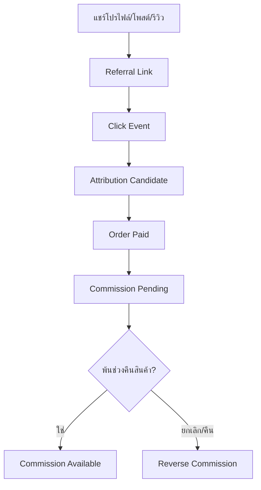

# AVENZO ONE Codex Implementation Starter Plan V7

> แผนแม่บทฉบับอัปเดตสำหรับพัฒนา AVENZO ONE แบบ Vertical Slice โดยใช้ V6 เป็นฐาน และเพิ่ม Customer Platform, Loyalty, Community และ Referral Commerce

**เวอร์ชัน:** 7.0  
**วันที่:** 5 สิงหาคม 2026  
**สถานะ:** พร้อมใช้วางสถาปัตยกรรมและแตกงานพัฒนา  
**ระบบเป้าหมาย:** Web Application แบบ Multi-tenant รองรับการขยายเป็น SaaS

---

## 1. ขอบเขตของ V7

V7 รับรองข้อกำหนดทั้งหมดของ `AVENZO ONE Codex Implementation Starter Plan V6` และเพิ่มโดเมนลูกค้าโดยไม่เปลี่ยนหลักการเดิมเรื่อง Multi-tenant, Permission, RLS, Audit Log, Domain Event, Stock Movement Ledger, Order Revision, Promotion Engine และ Fulfillment Lifecycle

สิ่งที่เพิ่ม:

- `Customer 360` เป็นฐานลูกค้ากลาง แยกจากรายงานยอดขาย
- สมัครและเชื่อมบัญชีด้วย LINE, Google หรือ Facebook
- ประวัติซื้อ แต้ม ระดับสมาชิก คูปอง เครดิต และความยินยอม
- โปรไฟล์ลูกค้าแบบ Public/Private ที่ไม่เปิดเผยข้อมูลส่วนตัว
- ข่าวร้าน สินค้าใหม่ โปรโมชัน และแจ้งเตือนไลฟ์
- Inbox และการโต้ตอบระหว่างร้านกับลูกค้า
- รีวิวจากผู้ซื้อจริง โพสต์ รูป/วิดีโอ และลิงก์ซื้อสินค้า
- Referral Link และ Sales Attribution
- Commission Ledger, ระยะพักค่านายหน้า และการย้อนรายการเมื่อคืนสินค้า
- Feed ชุมชนขนาดเล็ก โดยยังไม่สร้างระบบวิดีโอหรือ Recommendation Engine แบบ TikTok

---

## 2. หลักการออกแบบที่ล็อกใน V7

### 2.1 รายงานยอดขายไม่ใช่ฐานลูกค้า

รายงานยอดขายเป็นข้อมูลธุรกรรมตามออเดอร์ ใช้ตอบคำถามว่าใครซื้ออะไร เมื่อใด ช่องทางไหน และยอดเท่าไร แต่ห้ามใช้เป็น Master Customer โดยตรง

โครงสร้างที่ถูกต้อง:

> Identity → Customer → Order → Loyalty → Content → Referral → Commission

ลูกค้าคนเดิมอาจมีชื่อ Facebook, ชื่อผู้รับ, เบอร์โทร, LINE และ Google ต่างกัน ระบบต้องรวมด้วยกฎที่ตรวจสอบได้ ไม่รวมอัตโนมัติเพียงเพราะชื่อคล้ายกัน

### 2.2 Customer ID กลาง

- ลูกค้าหนึ่งคนมี `customer_id` กลางหนึ่งรายการต่อร้าน/องค์กร
- ลูกค้าหนึ่งคนเชื่อมหลาย Identity Provider ได้
- การเชื่อมบัญชีใหม่ต้องไม่สร้างแต้ม เครดิต หรือประวัติซื้อซ้ำ
- การรวม Customer Record ต้องมี Preview, เหตุผล, ผู้อนุมัติ และ Audit Log
- การแยกบัญชีที่รวมผิดต้องย้อนกลับได้โดยไม่ทำลาย Ledger

### 2.3 ข้อมูลส่วนตัวแยกจากข้อมูลสาธารณะ

| ข้อมูลส่วนตัว | ข้อมูลสาธารณะที่ลูกค้าเลือกเปิด |
|---|---|
| เบอร์โทร อีเมล ที่อยู่ | รูปโปรไฟล์และชื่อแสดง |
| ประวัติซื้อ ยอดชำระ คืนเงิน | Bio, รีวิว และโพสต์ |
| แต้ม เครดิต คูปอง | สินค้าที่แนะนำ |
| บัญชีรับเงินและเอกสารยืนยัน | จำนวนผู้ติดตาม/กำลังติดตาม |
| Consent และประวัติการติดต่อ | ลิงก์โปรไฟล์สาธารณะ |

การเปิดโปรไฟล์เป็น Public ไม่ทำให้ข้อมูลฝั่งซ้ายเปิดเผย

### 2.4 นายหน้าชั้นเดียวก่อน

V7 ออกแบบและพัฒนาระยะแรกเป็น Single-level Referral:

> ลูกค้า A แชร์รีวิว/โพสต์ → ลูกค้า B ซื้อผ่านลิงก์ → ลูกค้า A ได้ค่านายหน้า

ระบบฐานข้อมูลเตรียมขยายหลายระดับได้ แต่ Multi-level/Downline ยังไม่เปิดใช้จนกว่าจะมีกฎธุรกิจ การบัญชี ภาษี Anti-fraud และการตรวจข้อกฎหมายที่ชัดเจน

---

## 3. Customer 360

### 3.1 Customer Profile ภายในร้าน

เจ้าหน้าที่ที่มีสิทธิ์ควรเห็น:

- Customer ID, ชื่อ และช่องทางที่เชื่อม
- Timeline การสั่งซื้อ ชำระเงิน จัดส่ง คืนสินค้า และเคสบริการ
- Lifetime Value, จำนวนออเดอร์, ซื้อครั้งล่าสุด และความถี่
- แต้ม ระดับสมาชิก คูปอง เครดิต และค่านายหน้า
- แท็ก กลุ่มลูกค้า หมายเหตุ และผู้ดูแล
- Consent รายช่องทางและหัวข้อที่ยินยอม
- รีวิว โพสต์ รายงานเนื้อหา และสถานะการ Moderation
- Referral Performance โดยไม่เปิดข้อมูลของลูกค้าปลายทางเกินจำเป็น

### 3.2 Identity Resolution

ระดับการจับคู่:

| ระดับ | ตัวอย่าง | การดำเนินการ |
|---|---|---|
| Verified | OAuth Provider ID เดียวกัน | เชื่อมอัตโนมัติได้ |
| Strong | เบอร์/อีเมลที่ยืนยันตรงกัน | เสนอให้เชื่อมและยืนยัน |
| Possible | ชื่อ/ที่อยู่คล้ายกัน | เข้าคิวตรวจ ห้ามรวมอัตโนมัติ |
| Conflict | ประวัติหรือเจ้าของบัญชีขัดกัน | ระงับการรวมและให้เจ้าหน้าที่ตรวจ |

ต้องมี `customer_merge_cases` และ `customer_merge_audits` สำหรับกรณีรวม/แยกบัญชี

### 3.3 ตารางหลัก

| ตาราง | หน้าที่ |
|---|---|
| `customers` | Customer ID กลางของร้าน |
| `customer_identities` | LINE/Google/Facebook/Auth Identity |
| `customer_private_profiles` | PII และข้อมูลติดต่อ |
| `customer_public_profiles` | ชื่อแสดง รูป Bio และ Visibility |
| `customer_addresses` | ที่อยู่พร้อมประวัติและค่า Default |
| `customer_consents` | ความยินยอมตามหัวข้อ ช่องทาง และเวลา |
| `customer_tags` | Tag/Segment สำหรับ CRM |
| `customer_notes` | หมายเหตุภายในและสิทธิ์การเข้าถึง |
| `customer_merge_cases` | คิวตรวจบัญชีที่อาจเป็นคนเดียวกัน |
| `customer_merge_audits` | ประวัติรวมและแยก Customer |

---

## 4. Authentication และ Account Linking

### 4.1 ช่องทางสมัคร

- LINE Login
- Google Sign-In
- Facebook Login

ลูกค้าต้องใช้ขั้นต่ำหนึ่งช่องทาง และเพิ่มช่องทางอื่นภายหลังได้ การตั้งรหัสผ่านไม่จำเป็นในรุ่นแรกหากใช้ OAuth ทั้งหมด

### 4.2 กฎความปลอดภัย

- ตรวจ Provider Token ฝั่ง Server
- ใช้ Provider Subject ID เป็นกุญแจหลัก ไม่ใช้ชื่อแสดง
- Account Linking ต้องยืนยันกับ Identity เดิมและ Identity ใหม่
- เปลี่ยนอีเมล/เบอร์ต้อง Re-verify
- Login, Link, Unlink และ Merge ต้องมี Security Audit
- ห้าม Unlink วิธีเข้าสู่ระบบสุดท้ายก่อนเพิ่มวิธีใหม่
- Session และ OAuth Redirect ต้องแยก Environment

### 4.3 การผูกออเดอร์เก่า

เมื่อสมัครสมาชิก ระบบเสนอออเดอร์เดิมที่น่าจะเป็นของลูกค้า แต่ต้องยืนยันด้วยข้อมูลที่ควบคุมได้ เช่น OTP เบอร์โทรหรือข้อมูลอ้างอิงออเดอร์ ห้ามให้ผู้ใช้ Claim ประวัติจากชื่อผู้รับเพียงอย่างเดียว

---

## 5. Customer Portal รุ่นแรก

### 5.1 หน้า Home

- สถานะออเดอร์ล่าสุด
- แต้ม ระดับสมาชิก คูปอง และเครดิต
- โปรโมชันที่มีสิทธิ์ใช้
- สินค้าใหม่และสินค้าแนะนำจากร้าน
- สถานะไลฟ์และกำหนดการไลฟ์ถัดไป
- Notification/Inbox ล่าสุด

### 5.2 หน้า Purchase History

- รายการซื้อและรายละเอียดราคา/ส่วนลด
- สถานะชำระเงิน แพ็ก ส่ง และเลขพัสดุ
- ดาวน์โหลดเอกสารที่ได้รับอนุญาต
- เปิด After-sales Case
- ปุ่มรีวิวเฉพาะสินค้าที่ผ่านเงื่อนไข

### 5.3 หน้า Loyalty & Wallet

- แต้มคงเหลือ แต้มรอรับ และแต้มใกล้หมดอายุ
- ประวัติได้/ใช้/คืน/หมดอายุแบบ Ledger
- ระดับสมาชิกและเงื่อนไขรักษาระดับ
- คูปองที่ใช้ได้/ใช้แล้ว/หมดอายุ
- Customer Credit แยกจาก Commission Balance

### 5.4 หน้า Public Profile

- รูป ชื่อแสดง Bio และลิงก์โปรไฟล์
- รีวิว/โพสต์ที่เปิด Public
- สินค้าที่แนะนำ
- สถิติ Public ขั้นต่ำ เช่น จำนวนโพสต์และผู้ติดตาม
- ปุ่ม Follow, Share และ Report

ไม่แสดงยอดซื้อ แต้ม เครดิต ที่อยู่ เบอร์โทร รายได้ค่านายหน้า หรือ Order ID

---

## 6. Loyalty และ Customer Credit

### 6.1 Loyalty Ledger

แต้มต้องเป็น Ledger ห้ามแก้ยอดคงเหลือตรง ๆ

สถานะรายการแต้ม:

`pending → available → redeemed / expired / reversed`

กฎเบื้องต้น:

- แต้มจากการซื้อเข้า `pending` จนพ้นเงื่อนไขยกเลิก/คืน
- ยกเลิกหรือคืนสินค้าต้องย้อนแต้มตามสัดส่วนที่อนุมัติ
- คืนส่วนลด/คูปองต้องใช้ Rule ที่ระบุ ไม่คำนวณตามความจำ
- การปรับแต้มด้วยมือต้องมีเหตุผลและสิทธิ์อนุมัติ
- `Customer Credit`, `Loyalty Point` และ `Commission` เป็นคนละ Ledger ห้ามรวมยอด

### 6.2 ตารางหลัก

- `loyalty_programs`
- `loyalty_tiers`
- `loyalty_rules`
- `loyalty_accounts`
- `loyalty_ledger_entries`
- `customer_credit_accounts` และ `customer_credit_ledger_entries` จาก V6
- `coupons`, `coupon_issuances`, `coupon_redemptions`

กฎอัตราแต้ม วันหมดอายุ การเลื่อนระดับ และการใช้ร่วมกับโปรโมชันยังเป็น Decision Gate ก่อน Implement

---

## 7. Content, Review และ Community

### 7.1 Verified Purchase Review

รีวิวเชื่อมกับ `order_item_id` เพื่อแสดงป้ายซื้อจริง โดยหนึ่งรายการสินค้าต้องรีวิวได้ตาม Policy ของร้านและไม่สร้างรีวิวซ้ำจากการแก้ข้อความ

เนื้อหาที่รองรับ:

- คะแนนและข้อความ
- รูปภาพ
- วิดีโอสั้นในระยะถัดไป
- Product/SKU ที่เกี่ยวข้อง
- Visibility: `public`, `followers`, `private`
- ปุ่มซื้อสินค้าตามรีวิว
- ลิงก์แชร์ภายนอกพร้อม Referral Code

### 7.2 Feed ขนาดเล็ก

รุ่นแรกเป็น Feed ตามเวลาและสิทธิ์การมองเห็น ประกอบด้วย:

- ประกาศและโพสต์จากร้าน
- โปรโมชันและสินค้าใหม่
- รีวิว/โพสต์จากลูกค้าที่ติดตามหรือเป็น Public
- แจ้งสถานะ Live

ไม่รวมในรุ่นแรก:

- Algorithmic Recommendation ซับซ้อน
- Infinite short-video experience
- Live streaming ที่ Host ภายใน AVENZO
- Direct message ระหว่างลูกค้ากับลูกค้า

### 7.3 Moderation

- ลูกค้าแก้/ลบโพสต์ของตนได้ตาม Policy พร้อมประวัติที่จำเป็น
- ร้านซ่อนหรือจำกัดการมองเห็นได้ แต่ต้องมีเหตุผลและ Audit
- ผู้ใช้ Report เนื้อหา/บัญชีได้
- มีคิวตรวจ `pending`, `approved`, `hidden`, `rejected`, `appealed`
- Media Upload ต้องจำกัดชนิด ขนาด และตรวจเนื้อหาที่ไม่เหมาะสม
- เก็บ Policy Version ที่ผู้โพสต์ยอมรับ

### 7.4 ตารางหลัก

- `content_posts`
- `product_reviews`
- `content_media`
- `content_product_links`
- `content_reactions`
- `customer_follows`
- `content_reports`
- `moderation_actions`
- `store_announcements`

---

## 8. Referral Attribution

### 8.1 Tracking Flow



### 8.2 ข้อมูลที่ต้องติดตาม

- Referrer Customer
- Link/Referral Code
- Source Object: profile, post, review หรือ campaign
- Product/SKU ที่เชื่อม
- Click Time, Channel และ Campaign Parameters
- Session/Attribution Window
- Order และ Order Item ที่เกิด Conversion
- Revenue Base, Commission Rule และ Calculation Snapshot
- สถานะยกเลิก คืนสินค้า ปลดล็อก และจ่ายเงิน

### 8.3 Attribution Policy ที่ต้องล็อกก่อน Implement

- First-click หรือ Last-click
- ระยะเวลา Attribution เช่น 7/14/30 วัน
- กรณีกดหลายลิงก์จากหลายคน
- กรณีใช้ Referral ร่วมกับ Paid Ads/Coupon
- Commission คิดจากยอดก่อนหรือหลังส่วนลด ค่าส่ง ภาษี และคืนสินค้า
- สินค้า/หมวดใดไม่มีค่านายหน้า
- ขีดจำกัดต่อออเดอร์/เดือน

ค่าเริ่มต้นที่แนะนำสำหรับ Prototype คือ Last eligible click ภายใน 7 วัน และบันทึก Snapshot ของกฎที่ใช้กับออเดอร์

### 8.4 Anti-fraud

- ห้าม Self-referral
- ตรวจบัญชีซ้ำ Device/Payment/Address ตามระดับความเสี่ยงและกฎหมาย
- ไม่ให้ค่านายหน้ากับออเดอร์ทดสอบ ยกเลิก หรือคืนเต็มจำนวน
- ระงับรายการผิดปกติไว้ตรวจแทนการลบทิ้ง
- มี Velocity Limit และ Risk Flag
- การ Override ต้องมีผู้อนุมัติ เหตุผล และ Audit

---

## 9. Commission Ledger และ Payout

### 9.1 Lifecycle

`estimated → pending → available → payout_requested → paid`

เส้นทางข้อยกเว้น:

`pending/available → held → released`  
`pending/available → reversed`

กฎสำคัญ:

- ห้ามเพิ่มยอดค่านายหน้าใน Customer Credit โดยตรง
- ทุก Commission อ้างอิง Order Item, Attribution และ Rule Snapshot
- คืนบางรายการต้อง Reverse ตามส่วนที่คืน
- ถ้าจ่ายแล้วจึงเกิดคืนสินค้า ให้สร้างยอดติดลบ/หักรอบถัดไปตาม Policy ห้ามแก้ Ledger เดิม
- การถอนต้องผ่านเกณฑ์ขั้นต่ำ การตรวจตัวตน และข้อมูลรับเงิน
- การจ่ายเงินจริงต้องมี Payout Batch, Payment Reference และ Reconciliation

### 9.2 ตารางหลัก

- `referral_links`
- `referral_clicks`
- `attribution_records`
- `commission_programs`
- `commission_rules`
- `commission_ledger_entries`
- `commission_holds`
- `payout_accounts`
- `payout_requests`
- `payout_batches`
- `payout_items`

---

## 10. Notification และการสื่อสาร

### 10.1 ประเภทการแจ้งเตือนลูกค้า

- ออเดอร์ การชำระ แพ็ก จัดส่ง และคืนสินค้า
- ร้านเริ่มไลฟ์หรือใกล้ถึงเวลาไลฟ์
- โปรโมชั่นและสินค้าใหม่
- แต้ม/คูปองใกล้หมดอายุ
- มีคนตอบ กดถูกใจ หรือติดตาม
- มี Conversion จาก Referral
- Commission พร้อมถอนหรือจ่ายแล้ว

### 10.2 Consent และ Preference

- แยก Transactional กับ Marketing Notification
- ลูกค้าเลือกหัวข้อ ช่องทาง ความถี่ และ Quiet Hours ได้
- ช่องทางภายนอกใช้เมื่อมี Consent และ Connection ที่ยังใช้ได้
- Unsubscribe การตลาดต้องไม่ปิดข้อความธุรกรรมที่จำเป็น
- ทุกการส่งมี Delivery Log, Provider Response และ Retry Policy
- Broadcast ต้องมี Audience Preview, จำนวนผู้รับ, Approval และ Rate Limit

Inbox รุ่นแรกให้ร้านส่งประกาศหรือดู Thread ร้าน–ลูกค้าได้ ส่วนลูกค้า–ลูกค้ายังไม่รวม

---

## 11. Domain Events เพิ่มเติม

- `customer.registered`
- `customer.identity_linked`
- `customer.merge_requested`
- `customer.merged`
- `customer.consent_changed`
- `loyalty.points_pending`
- `loyalty.points_available`
- `loyalty.points_reversed`
- `review.created`
- `content.reported`
- `content.moderated`
- `store.live_started`
- `referral.link_opened`
- `referral.attributed`
- `commission.estimated`
- `commission.available`
- `commission.held`
- `commission.reversed`
- `payout.requested`
- `payout.paid`

Event ต้องมี `organization_id`, Actor, Customer, Source Entity, Correlation ID, Occurred At และ Idempotency Key ตามความเหมาะสม

---

## 12. Permission, Privacy และ Tenant Isolation

### 12.1 บทบาทเพิ่มเติม

| Role | ขอบเขต |
|---|---|
| CRM Manager | Customer 360, Segment และ Campaign |
| Community Moderator | Review, Post, Report และ Moderation |
| Loyalty Manager | Rule แต้ม Tier และ Coupon |
| Affiliate Manager | Referral, Commission, Hold และ Payout |
| Support Agent | Order/Customer Timeline ตามข้อมูลที่จำเป็น |

### 12.2 กฎบังคับ

- ทุก Customer/Content/Referral/Commission Record ต้องผูก `organization_id`
- RLS ป้องกันข้อมูลข้ามร้านและแยก Staff View กับ Customer View
- Customer อ่านข้อมูลส่วนตัวของตนเองเท่านั้น
- Public Query ใช้ View/DTO ที่ Allowlist Field ห้ามเปิดตาราง PII โดยตรง
- จำกัดการค้นหารายชื่อลูกค้าเพื่อป้องกัน Enumeration
- Media ใช้ Signed/Controlled Access ตาม Visibility
- Export/Delete Request ต้องรองรับข้อกำหนดด้านข้อมูลส่วนบุคคลและ Retention Policy
- Log ห้ามเก็บ Token, PII เต็ม หรือข้อมูลบัญชีรับเงินเกินจำเป็น

ก่อน Production ต้องให้ผู้เชี่ยวชาญตรวจ PDPA, เงื่อนไขการตลาด, ภาษี/เอกสารค่านายหน้า และข้อกำหนดของ OAuth/Messaging Provider

### 12.3 Platform Foundation Roadmap Status

อัปเดตล่าสุด: 8 สิงหาคม 2026

| ระยะ | สถานะ | หมายเหตุ |
|---|---|---|
| Phase 0.1–0.8 Multi-tenant, Role, Auth, Invitation และ Member Management | เสร็จแล้ว | ผ่านการทดสอบการใช้งานหลักและสิทธิ์สมาชิก |
| Phase 0.9 Security Hardening และ Audit Log | เสร็จสำหรับ Development | Password ขั้นต่ำ 8 ตัวอักษร, Strong Character Requirements, Secure Password Change และ Current Password Verification เปิดแล้ว |
| Phase 0.9 Production Security Gate | รอก่อน Production | ต้องอัปเกรด Supabase เป็น Pro เปิด Leaked Password Protection และตรวจ Security Advisor ให้ไม่มี WARN |
| Phase 0.10.1 Platform Admin TOTP Enrollment | เสร็จและทดสอบผ่าน | มีหน้า QR/Secret, ยืนยันรหัส 6 หลัก, ตรวจ Platform Admin ซ้ำ และ Audit โดยไม่เก็บ TOTP Secret หรือ OTP |
| Phase 0.10.2 Platform Admin MFA Challenge | เสร็จและทดสอบผ่าน | Login นำทางอัตโนมัติ, หน้า Challenge รหัส 6 หลัก, Server ตรวจ AAL ซ้ำ และมีปุ่มลัด Platform Admin |
| Phase 0.10.3 Platform Admin MFA RLS Enforcement | Implemented / รอทดสอบครบเส้นทาง | บังคับ `aal2` ที่ Database/RLS สำหรับสิทธิ์ Control Plane โดยไม่กระทบ Tenant RBAC |
| Phase 0.10.4 Platform Admin MFA Recovery | Implemented / รอทดสอบการใช้งานจริง | รองรับ Authenticator หลักและสำรอง, เลือก Factor ตอน Challenge, ถอดอุปกรณ์แบบคง Factor สุดท้าย, Session Revocation และ Audit Log |
| Phase 1.0.1 Feature Catalog | Implemented / รอทดสอบการใช้งานจริง | ทะเบียน Feature แบบเปิด/ปิดหรือ Limit พร้อม Combo Box ภาษาคนและโหมดกำหนดเอง, Lifecycle, AAL2 RLS และ Audit Log โดยยังไม่กระทบ Entitlement ปัจจุบัน |
| Phase 1.0.2 Plans และ Prices | Implemented / รอทดสอบการใช้งานจริง | สร้าง Plan, Plan Version, ราคา, Trial และค่า Feature โดยยังไม่กระทบ Subscription เดิม |
| Phase 1.0.2.1 Plan Lifecycle Management | Implemented / รอทดสอบการใช้งานจริง | เก็บ Draft, ปิดใช้งาน Plan และ Retired แบบไม่ลบข้อมูล พร้อม Audit Log |
| Phase 1.0.3 Entitlement Enforcement | เสร็จและทดสอบผ่าน | ผูก Organization Subscription กับ Active Plan Version, บังคับสิทธิ์และจำนวนสาขาที่ Database/UI, รองรับ Legacy Subscription และผ่านการ Provision จริงกับ AVENZO THAILAND |
| Phase 1.0.3.1 Draft Version Editing | Implemented / รอทดสอบ UI โดยผู้ใช้ | แก้ Draft Version, อายุ, Grace, ราคาและ Feature เดิมได้; เก็บ Draft แบบ Retired และล็อก Active Version เป็น Snapshot |
| Phase 1.0.4.1 Subscription Preview & Automatic Dates | เสร็จและทดสอบผ่าน | เลือกราคา Active, คำนวณ Expiry/Grace/Trial อัตโนมัติ, ตรวจสอบข้อมูลก่อนยืนยัน และบันทึก Price Snapshot ใน Subscription Event สำเร็จ โดยยังไม่เรียกเก็บเงินจริง |
| Phase 1.0.4.2 Subscription Lifecycle & History | Implemented / รอทดสอบ UI โดยผู้ใช้ | สถานะภาษาไทย Trial/Active/Grace/Suspended/Expired/Canceled, Action ต่ออายุ/ปรับ/พัก/เปิดต่อ/ยกเลิก, Preview, Event History 10 รายการต่อหน้า และ Command ID ป้องกันคำสั่งซ้ำ |
| Phase 1.0.4.2.1 Form Typography & Inline Validation | Implemented / รอทดสอบ UI โดยผู้ใช้ | ฟอนต์ช่องกรอกเป็นมาตรฐานเดียวกัน, ปิด Browser Popup, แจ้งเตือนด้วยไอคอน i, รองรับ aria และตรวจเหตุผลอย่างน้อย 3 ตัวอักษร |
| Phase 1.0.5.1 Notification Rules & Queue | เสร็จและทดสอบผ่าน | กฎแจ้งเตือน 7 ช่วงเวลา, Queue Preview, ป้องกันรายการซ้ำ, Owner Recipient, AAL2 RLS, Audit Log และ UI 10 รายการต่อหน้า โดยยังไม่ส่งอีเมลจริง |
| Phase 1.0.5.2 Scheduler & Delivery Worker | Production Live Delivery พร้อมใช้งาน | Atomic Claim, Resend Idempotency, Retry Backoff สูงสุด 5 ครั้ง, Delivery Log, Manual Run และ Supabase Cron รายชั่วโมง; Endpoint Production และ Resend delivery ทำงานแล้ว |
| Phase 1.0.5.3 Resend Webhook & Suppression | เสร็จและเชื่อม Production แล้ว | ตรวจลายเซ็น Svix จาก Raw Body, กัน Event ซ้ำและ Event มาไม่เรียงลำดับ, แสดงสถานะส่งจริงภาษาไทย และหยุดส่งอัตโนมัติเมื่อ Bounce/Complaint/Suppression |
| Phase 1.0.5.4 Production Deployment & Supabase Cron | เสร็จและทดสอบผ่าน | Deploy บน Vercel Hobby ที่ `app.avenzoone.com`, ใช้ Supabase Cron รายชั่วโมง, เก็บ Secret ใน Vault, ตั้ง Supabase Auth Redirect และเชื่อม Resend Webhook; ทดสอบ Browser/API/Cron ได้ HTTP 200 |
| Phase 1.0.6 Production Monitoring & Alerts | เสร็จและทดสอบ Production ผ่าน | บันทึก Worker Run, ตรวจ Cron/Queue/Resend/Webhook, แสดง Alert ภาษาไทยสำหรับ Platform Admin AAL2, เพิ่ม Structured Runtime Log, จำกัด Vercel Environment Variables ให้เฉพาะ Production และทดสอบ Worker โหมด Live ได้ HTTP 200 โดยไม่มี Error |

ห้ามเปิด Production หาก Phase 0.9 Production Security Gate ยังไม่ผ่าน แม้ระบบ Development จะใช้งานได้ครบตาม Acceptance Criteria แล้ว และต้องตรวจร่างประกาศความเป็นส่วนตัว/ข้อกำหนดการใช้งานโดยผู้เชี่ยวชาญด้านกฎหมายและ PDPA ก่อนเผยแพร่

---

## 13. Vertical Slice Roadmap

| ระยะ | ผลลัพธ์ที่ส่งมอบ | ยังไม่รวม |
|---|---|---|
| C1 Customer Identity | สมัคร 1 Provider, Customer ID, Profile ส่วนตัว, ผูกออเดอร์ที่ยืนยันแล้ว | Merge อัตโนมัติหลายแหล่ง |
| C2 Purchase & Loyalty | ประวัติซื้อ, แต้ม Ledger, Tier/คูปองพื้นฐาน | Rule ซับซ้อนหลายร้าน |
| C3 Store Engagement | ข่าวร้าน สินค้า/โปรใหม่ Live Alert, Inbox และ Preferences | Customer-to-customer DM |
| C4 Verified Review | รีวิวผู้ซื้อจริง รูป Product Link, Public Profile และ Moderation | Video Feed เต็มรูปแบบ |
| C5 Referral Commerce | Share Link, Click, Attribution, Conversion และ Commission Pending | Multi-level Downline |
| C6 Payout | Available Balance, Request, Approval, Batch และ Reconciliation | จ่ายอัตโนมัติทุก Provider |
| C7 Community Feed | Follow, Reaction และ Feed ตามเวลา | Recommendation Algorithm |

แต่ละระยะต้องเป็น Vertical Slice ที่เชื่อม UI → Server → Database → Event → Notification → Permission/RLS → Test

---

## 14. Acceptance Criteria

### 14.1 Customer Identity

- ลูกค้าสมัครด้วย Provider ที่อนุมัติและได้ Customer ID หนึ่งรายการ
- เชื่อม Provider เพิ่มแล้วไม่สร้าง Customer, Point หรือ Order ซ้ำ
- Claim ออเดอร์เก่าต้องผ่านการยืนยัน
- Staff ไม่มีสิทธิ์ไม่สามารถอ่าน PII
- Public Profile ไม่คืน Field ส่วนตัวแม้เรียก API โดยตรง
- Tenant A อ่าน Customer ของ Tenant B ไม่ได้

### 14.2 Loyalty

- แต้มจาก Order ที่ยังคืนได้เป็น Pending
- เมื่อผ่านเงื่อนไขจึงเป็น Available
- Cancel/Return สร้าง Reversal Entry ไม่แก้ยอดเดิม
- Balance คำนวณย้อนกลับจาก Ledger ได้
- การปรับมือมีเหตุผลและ Audit

### 14.3 Review และ Community

- Verified Badge ต้องตรวจจาก Order Item จริง
- Visibility ถูกบังคับทั้ง API, RLS และ Media Access
- Report สร้าง Moderation Case และแจ้งผู้มีสิทธิ์
- การซ่อนมีเหตุผลและประวัติ
- ปุ่มซื้อจากรีวิวส่ง Source Attribution ครบ

### 14.4 Referral และ Commission

- ทุก Referral Link ระบุเจ้าของและ Source Object ได้
- Click ซ้ำไม่สร้าง Commission ซ้ำ
- Order Snapshot ระบุกฎ Attribution และ Commission ที่ใช้
- Self-referral ถูกปฏิเสธหรือเข้า Hold ตาม Policy
- Cancel/Return ย้อน Commission ตาม Order Item
- Commission ยังถอนไม่ได้จนเป็น Available
- Ledger รวมย้อนหลังตรงกับยอด Estimated/Pending/Available/Paid

### 14.5 Notification

- Transactional และ Marketing ถูกแยก Preference
- Marketing ส่งเฉพาะผู้มี Consent
- Live Alert ป้องกันส่งซ้ำด้วย Idempotency
- ลูกค้าเลือกช่องทางและยกเลิกการตลาดได้
- ทุก Delivery ตรวจสถานะและ Retry ได้

---

## 15. Testing Matrix เพิ่มเติม

- Unit: Point, Attribution, Commission และ Reversal Calculation
- Integration: OAuth Link/Unlink, Order Claim, Ledger Posting, Return Reversal
- RLS: Staff Role, Customer Self-access, Public Profile และ Cross-tenant Isolation
- E2E: สมัคร → เห็นประวัติ → รีวิว → แชร์ → ผู้ซื้อใหม่สั่ง → Commission Pending → Available
- Security: Account Takeover, OAuth CSRF/State, Enumeration, Media Access และ Self-referral
- Idempotency: Provider Callback, Click, Paid Order, Return และ Payout Retry
- Migration: Customer Deduplication และการนำเข้าข้อมูลจากรายงานยอดขาย
- Moderation: Report, Hide, Appeal และ Restore Visibility

---

## 16. Decision Gates ก่อนเริ่มแต่ละ Slice

ต้องตัดสินใจและบันทึกก่อน Implement:

1. ร้านแรกจะเปิดสมัครด้วย Provider ใดก่อน
2. วิธี Claim ออเดอร์เก่าและกฎ Merge Customer
3. อัตราแต้ม วันหมดอายุ Tier และกฎคืนสินค้า
4. Public Profile เป็น Opt-in หรือ Private โดยค่าเริ่มต้น
5. ใครโพสต์ได้และร้านตรวจรีวิวก่อนเผยแพร่หรือไม่
6. รองรับรูป/วิดีโอ ขนาด และ Retention เท่าใด
7. First-click/Last-click และ Attribution Window
8. ฐานคำนวณ Commission และรายการที่ไม่ร่วม
9. Holding Period, ยอดถอนขั้นต่ำ และรอบจ่าย
10. Self-referral/Fraud Policy และขั้นตอนอุทธรณ์
11. Consent Text, ช่องทางการตลาด และ Quiet Hours
12. ข้อกำหนดภาษี เอกสารผู้รับค่านายหน้า และ PDPA

ห้าม Codex เดาค่าทางธุรกิจที่มีผลต่อเงิน สิทธิ์ ความเป็นส่วนตัว หรือกฎหมายโดยไม่มี Decision Record

---

## 17. ลำดับรวมหลัง Sprint 1

1. Foundation Vertical Slice ตาม V6
2. Product/SKU, Warehouse, Stock Movement Ledger
3. Live CF, Reservation, Waitlist และ Customer Chat Workspace
4. Order Revision, Payment, Refund และ Customer Credit
5. Promotion Engine, FF Benefit และ Group Repricing
6. Picking, Packing, Shipping และ Return QC
7. Customer Identity + Customer 360
8. Purchase History + Loyalty Ledger
9. Store Engagement + Notification Preference
10. Verified Review + Public Profile + Moderation
11. Referral Attribution + Commission Ledger
12. Payout + Reconciliation
13. Community Feed
14. พิจารณา Multi-level Referral เฉพาะเมื่อผ่าน Decision Gate ใหม่

สามารถขยับข้อ 7–9 ให้เร็วขึ้นหลัง Order/Customer Model เสถียร แต่ไม่ควรสร้าง Referral ก่อน Order Revision, Return และ Ledger พร้อม เพราะจะคำนวณและย้อนค่านายหน้าไม่ถูกต้อง

---

## 18. Prompt สำหรับเริ่มออกแบบ Customer Slice ใน Codex

```text
อ่านเอกสารต่อไปนี้ทั้งหมดก่อนแก้โค้ด:
1. AVENZO_ONE_Codex_Implementation_Starter_Plan_V7.md
2. AVENZO_ONE_Design_System_and_UIUX_Standards_V1.md
3. AGENTS.md และเอกสารสถาปัตยกรรมใน Repository

เริ่มด้วย Inspect Repository, Schema, Auth, Order, Customer และ RLS ที่มีอยู่ แล้วรายงานผลกระทบก่อน Implement

เป้าหมาย Slice แรก:
- สมัครลูกค้าด้วย Identity Provider ที่ระบุใน Decision Record
- สร้าง Customer ID กลางหนึ่งรายการ
- แยก Private Profile กับ Public Profile
- ผูก Order ที่ยืนยันเจ้าของแล้ว
- แสดง Purchase History ขั้นต่ำ
- สร้าง Domain Event และ Audit Log ที่เกี่ยวข้อง
- บังคับ Customer Self-access, Staff Permission และ Tenant Isolation ผ่าน Server/RLS

ห้ามสร้าง Social Feed, Referral, Commission หรือ Multi-level Downline ใน Slice นี้
ห้ามเดา Loyalty Rate, Attribution Window, Commission Rate หรือ Consent Policy

ก่อนลงมือให้เสนอ:
1. Current-state findings
2. Schema/API/RLS impact
3. Migration และ rollback plan
4. Acceptance criteria และ test cases
5. รายการ Decision ที่ยังต้องถาม
```

---

## 19. Versioning Rule

เมื่อเพิ่มหรือเปลี่ยนแปลงแผนระบบอย่างมีนัยสำคัญ ให้เพิ่ม Decision Log, อัปเดตผลกระทบต่อโมดูล, เพิ่มเวอร์ชัน, เก็บ Changelog และถามผู้ใช้ว่า:

> **ต้องการให้อัปเดตแผนเป็นเวอร์ชันใหม่ด้วยหรือไม่?**

---

## Changelog

### V7.0 — 5 สิงหาคม 2026

- เพิ่ม Customer 360 และ Customer ID กลาง แยกจากรายงานยอดขาย
- เพิ่ม LINE/Google/Facebook Identity Linking และกฎ Claim Order เก่า
- แยกข้อมูลส่วนตัวจาก Public Profile และกำหนด Privacy/RLS Baseline
- เพิ่ม Purchase History, Loyalty Ledger, Tier, Coupon และ Consent
- เพิ่ม Store Engagement, Live Alert, Inbox และ Notification Preference
- เพิ่ม Verified Purchase Review, Post, Public Profile, Follow และ Moderation
- เพิ่ม Referral Link, Click Tracking, Attribution Policy และ Anti-fraud
- เพิ่ม Commission Ledger, Holding Period, Reversal, Payout และ Reconciliation
- กำหนดให้เริ่ม Single-level Referral และเลื่อน Multi-level/Downline ออกไป
- เพิ่ม Domain Events, Entity, Roadmap, Acceptance Criteria, Testing Matrix และ Decision Gates

### V6.0 — 5 สิงหาคม 2026

- Live CF, Customer Chat และ Order Workspace
- FF เป็น Free-shipping Benefit ไม่ใช่ SKU
- Promotion Engine, Mixed-item Group Repricing และกฎใช้โปรร่วมกัน
- Order Revision, Payment Difference, Refund และ Customer Credit Ledger
- Inventory Lifecycle, Fulfillment Workspace และ Stock Movement Ledger

---

**เอกสารฐาน:** `AVENZO_ONE_Codex_Implementation_Starter_Plan_V6.md`  
**เอกสารมาตรฐาน UI:** `AVENZO_ONE_Design_System_and_UIUX_Standards_V1.md`
